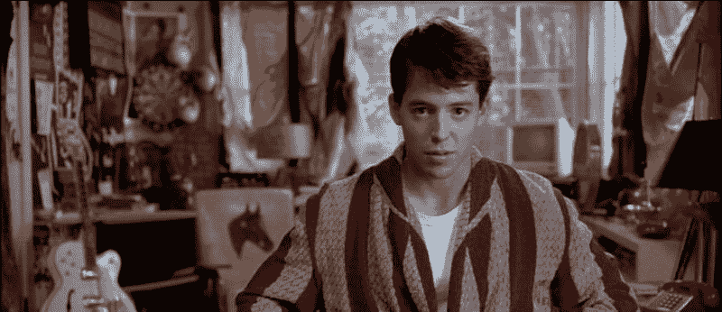

# 课堂中的社会工程

> 原文：<https://www.social-engineer.org/social-engineering/social-engineering-the-classroom/>

有些人喜欢上学，有些人喜欢离开学校，就像费里斯·布勒一样。你真的找不到比《费里斯·布勒的休息日》更经典的 SE 了，但是这部电影关注的是操纵的力量和[逃避的融洽](https://www.social-engineer.org/how-tos/creating-connections-to-persuade-your-targets/)，SEORG 越来越多地报道学生们在课堂上专注于 SE 的学习。InfoSec 项目如此重视 SE，这是多么令人兴奋的消息啊！我们自己的克里斯·哈德纳吉作为[卡耐基·梅隆大学](http://heinz.cmu.edu/school-of-information-systems-and-management/cio-institute/chief-information-security-officer-executive-education-and-certification-program/index.aspx)的兼职讲师，甚至在帮助推进这种类型的研究。

[T3】](https://www.social-engineer.org/wp-content/uploads/2015/05/6a010535f9f0cc970c0120a5f551f5970c-800wi.jpg)

> *“我* *不可信！我职业生涯中最糟糕的表现之一，* *他们从来没有怀疑过这一点！”*

在过去一年左右的时间里，有相当多的人就论文或研究与我们联系。由于这些人中有许多是学生，不幸的是他们的工作不会像一些知名公司的报告那样在 Twitter 上流行，我们想与那些喜欢人类黑客的人分享一些最近的例子:

*   [Dnfalk 的研究](http://blog.dnfalk.com/security-awareness-in-k-12-school-districts/)“K-12 学区的安全意识”采用了一种重测研究设计，通过调查来观察[安全意识培训](https://www.social-engineer.org/how-tos/change-education-working/)、[物理安全](https://www.social-engineer.org/podcast/ep-067-getting-physical-with-deviant-ollam/)评估和[网络钓鱼](https://www.social-engineer.org/framework/general-discussion/real-world-examples/phishing/)测试。在他的博客上可以找到一篇精彩的文章。
    有趣的花絮:55%的受访者不知道什么是网络钓鱼攻击，但 82%的人认为他们的计算机是安全的；几乎 8%的人将密码藏在键盘下，尽管在第一次评估后这一比例下降到了 4%。

丹的研究的一个伟大之处是，他帮助建立了针对他的目标人群，即 K-12 员工的安全意识的基线测量，这可以应用于进一步的研究。他还提出了一个研究设计，可以被其他人复制，以进一步验证“通过教育实现安全”的发现(是的，我们喜欢这一点)。

*   另一名学生，杰瑞米·米勒，在他的数字[辩论](https://www.social-engineer.org/newsletter/Social-EngineerOrgNewsletterVol.03%20Iss.28.htm)课上，选择通过[认知偏差](https://www.social-engineer.org/newsletter/social-engineer-newsletter-volume-4-issue-55/)的透镜来检验社会工程技术。
    有趣的花絮:[转述]认知偏见被各种各样的行为者(例如圣灵降临派)以多种方式利用人性和常见的刻板印象。[托词](https://www.social-engineer.org/framework/influencing-others/pretexting/successful-pretexting/)是常见的[例子](https://www.social-engineer.org/newsletter/social-engineer-newsletter-volume-4-issue-55/)。

不确定什么是[认知偏差](https://www.social-engineer.org/newsletter/social-engineer-newsletter-volume-4-issue-54/)或者它与 SE 有什么关系？米勒关于光环效应的例子可能会有所帮助。“要利用这种认知效应，你不需要成为最有魅力、穿着得体或最漂亮的人。Yudkowsky 表明，根据 Cialdini 和其他人的研究，在同一个人身上看到的任何一组积极特征都可能由于偏见而被感知。例如，如果某人看起来善良、慷慨，也许有人会认为他们也聪明、诚实。因此，社会工程师可以利用这种“情感启发法”，只要让自己看起来在多种可取的特质上具有积极的天赋。

Social-Engineer.org 很自豪能成为那些试图了解如何入侵人类的人的资源。我们希望听到教室里的其他人(包括艰苦卓绝的学校)和你正在学习的东西。所以伸出手。这就是我们在这里的目的。

继续学习！

*资料来源:
[1]尤德科夫斯基，埃利泽。*理性:从 AI 到僵尸*。机器智能研究所。2015.*