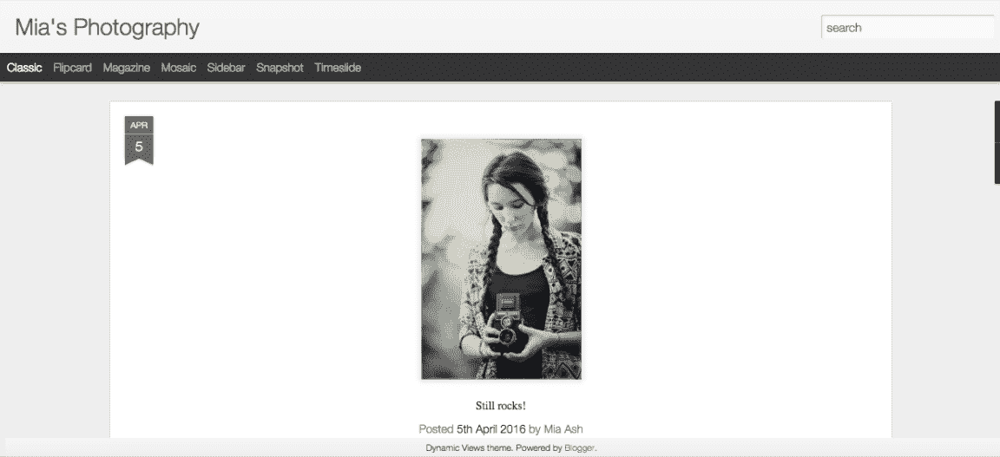

# 社交媒体——不要被过度曝光烧伤

> 原文：<https://www.social-engineer.org/general-blog/social-media-dont-get-burned-overexposure/>

恶意攻击者不知疲倦地搜索个人和专业信息；他们想要这一切。事实上，信息为攻击者提供了他们所需要的知识来协调引发特定情绪反应的方法。他们的目标？达成妥协或违约。他们在哪里找到所有这些个人和专业信息？让我们来看看使用的一种方法；社交媒体平台，如脸书和 LinkedIn。这样做将在两个方面帮助我们:1)它将告诉我们为什么我们需要警惕地保护个人和专业信息，2)它将确定通过教育和培训来加强的脆弱领域。认识到过度曝光于社交媒体会让我们受到伤害，这一点很重要。

## **脸书**

你有没有注意到有多少人分享他们在脸书的生活？想想你发布的所有个人信息。例如，你会发布你的家庭关系、生日、纪念日、工作、爱好、假期、宠物、孩子们去过的夏令营、最喜欢的餐馆、慈善机构以及社会和政治兴趣吗？当然，你可能会发布照片、照片和更多照片。

## **LinkedIn**

LinkedIn 已经成为最受专业人士欢迎的社交平台之一。如果你有一个账户，想想你在你的个人资料中包括什么；姓名、照片、地点、职业、工作经历/历史、教育、特殊兴趣和你关注的群体。

社交媒体平台让攻击者比以往任何时候都更容易收集信息。此外，LinkedIn 提出了一个真正的第 22 条军规。事实上，组织和他们的员工都希望有一个最新的和积极的存在。然而，不良行为者可以利用社交工程和网络钓鱼攻击中的这种存在。有鉴于此，让我们看看攻击者如何利用社交媒体平台收集信息，从而导致危害和破坏。

## **米娅·阿什**

如果你没有听说过“米娅·阿什”，她的脸书简介和照片描述她是一个有吸引力的英国女人，拥有两个艺术学位和一个成功的摄影业务，名为“米娅的摄影”。然而实际上，她是由伊朗政府资助的间谍创造的一个角色，被称为石油钻塔/钴吉普赛人。虽然角色是假的，但照片是真的。攻击者从几个社交媒体账户上窃取了数百张照片，这些照片属于一名罗马尼亚摄影师和学生。

## **社交媒体在信息收集中的作用** 

虽然使用一个有吸引力的女人作为美人计并不新鲜，但我们的重点是社交媒体平台在收集攻击信息方面的作用。如果最初的一般网络钓鱼尝试没有导致预期的点击，Mia Ash 将使用 LinkedIn 从目标组织中搜索出其职称表明对目标公司网络具有管理或高级访问权限的员工。

当 Mia Ash 找到一个有合适资质的员工时，她会在 LinkedIn 上与他联系。典型的对话是关于他的工作，她的摄影事业，以及她进行的各种旅行。在 LinkedIn 上建立融洽关系后，她会邀请员工在脸书上继续对话。在花了几个月的时间培养与该员工的关系后，Mia 会表面上寻求与她的摄影业务有关的帮助；为袭击做准备。个人的妥协不是最终目标，而是作为发射台。

## 米娅·阿什和德勤

2016 年 7 月，米娅·阿什瞄准了四大会计师事务所之一的德勤。首先，她在 LinkedIn 上与一名网络安全员工就他的工作进行了交谈。接下来，她通过照片分享和信息传递建立了融洽的关系和信任。事实上，这位德勤员工甚至主动提出帮助米娅·阿什为她的摄影业务建立一个网站。最后，侦察和信息收集得到了回报。她策划发起了攻击，一封网络钓鱼邮件。据称，米娅·阿什(Mia Ash)说服这位德勤员工在他的工作笔记本电脑上打开了一个包含她一些照片的文件。包含这些照片的电子邮件被植入了名为 PupyRAT 的恶意软件，旨在窃取凭证。

## **米娅·阿什和一家中东公司**

据 SecureWorks 报道，Mia Ash 使用 LinkedIn 搜索并联系了一名来自目标组织的员工，并询问了关于 you guessed it，photography 的问题。米娅·阿什和这位员工互相发信息交流他们的职业、摄影和旅行。Mia 然后问他是否可以加她为脸书的朋友，这样他们就可以在那里继续他们的对话。大约一个月后，她邀请他参加一项摄影调查。她又一次策划了攻击，一封钓鱼邮件。一份微软 Excel 文档“Photography Survey.xlsm 的副本”被发到了他的个人邮箱里。Mia 告诉他，只有在他的公司电子邮件帐户中打开，调查才能正常进行。他答应了；附件中的调查包含了他启用的释放 PupyRAT 的宏。

## **埃利安娜和以色列国防军**

哈马斯特工伪造了漂亮年轻女性的脸书简介。他们的目标？引诱不知情的以色列国防军士兵安装病毒，将他们的移动设备变成一本打开的书。联系人、位置、应用程序、图片都可以被哈马斯特工获取；危及士兵和潜在的以色列国防军组织。哈马斯特工是如何找到他们的目标的？有理由得出结论，社交媒体平台以及在线搜索引擎产生了所需的信息。所有被作为目标的以色列国防军士兵都是通过公开照片找到的，照片上的标签和帖子显示他们在以色列国防军服役。

## **不要过度曝光** 

持续使用社交媒体平台寻找潜在受害者表明这种信息收集方法非常成功。精心策划的社会工程攻击带来了毁灭性的后果。在针对德勤的攻击中，值得注意的是，一名网络安全员工成为了骗局的受害者。

社交媒体平台上个人和职业过度曝光的危险对我们来说并不是一个新话题。我们已经在我们的[简讯、](https://www.social-engineer.org/newsletter/6132/)和[框架](https://www.social-engineer.org/framework/information-gathering/technical-methods-of-information-gathering/)中讨论过了。然而，从这些最近的例子来看，很明显我们不能放松警惕。那么，我们能做什么呢？

## **锁定社交媒体账户**

当涉及到发布到社交媒体平台的个人和专业信息时，请考虑“安全第一”。试试这个:谷歌一下你的名字，看看有什么信息和图片。问问你自己:我会希望别人看到它吗？这些信息应该受到保护吗？如果是这样，不要被过度曝光烧伤。使用隐私设置锁定信息，或者考虑根本不发布。花点时间成为隐私设置“专家”。这里有一个起点:脸书的隐私基础知识，包括[管理你的隐私](https://www.facebook.com/about/basics/manage-your-privacy)和[保持安全](https://www.facebook.com/about/basics/stay-safe-and-secure)。还有，知道 LinkedIn 上的[隐私设置](https://www.linkedin.com/help/linkedin/answer/66/managing-your-account-and-privacy-settings-overview?lang=en)以及如何实现。请考虑将“公共”和“所有成员”设置仅更改为“连接”。

在接受社交媒体连接请求之前，请验证用户的真实性。对于高管和员工来说，社交媒体使用的明确指导方针以及识别潜在网络钓鱼诱惑的教育至关重要。需要制定明确的公司政策来报告通过公司电子邮件、个人电子邮件和社交媒体平台收到的潜在网络钓鱼邮件。

## **结论**

让我们不要满足于只是一个复选框的培训方法。定制和互动的持续培训可以减轻因过度暴露在社交媒体上而造成的数据泄露威胁。

“告诉我，我会忘记的。教我，我会记住。让我参与，我学习。”据称是本杰明·富兰克林，可能是荀况。

*来源:*
*[https://www . secureworks . com/research/the-curious-case-of-mia-ash http://www . claws . in/1800/to-believe-or-not-believe-mia-ash-deba shish-bose . html](https://www.secureworks.com/research/the-curious-case-of-mia-ash)*
*[https://www . wired . com/story/Iran-hackers-social-engineering-mia-ash/](https://www.wired.com/story/iran-hackers-social-engineering-mia-ash/)*