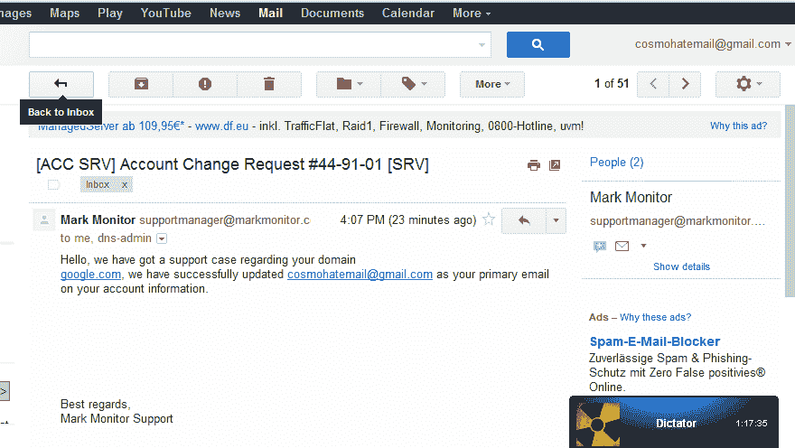

# 戳破最大的骗局

> 原文：<https://www.social-engineer.org/social-engineering/spearing-the-biggest-phish/>

我们的“社会工程捕捉旗帜”事件凸显的一个主要问题是，正是这些公司自己大肆泄露信息。 [Defcon 19](https://www.social-engineer.com/social-engineering-capture-the-flag-report/ "Defcon 19 SECTF Report") 向我们展示了一个全面的社会工程攻击可以通过简单地使用互联网上免费提供的开源信息(OSI)来进行，这些信息大部分来自公司本身。我们看到了通行证的张贴，完整的安全示意图和程序手册，以及我们最喜欢的全功能员工搜索引擎！

利用收集到的 OSI，攻击者可以发动一次成功的攻击。2012 年 6 月 11 日就是如此。据报道，黑客组织 UGNazi 获得了谷歌的 Mark Monitor 账户，并通过利用社会工程，说服 Mark Monitor 员工 Olga Bougri 将 Google.com 电子邮件地址重置为该组织的电子邮件[【电子邮件受保护】](/cdn-cgi/l/email-protection)

[T2】](https://www.social-engineer.org/social-engineering/spearing-the-biggest-phish/attachment/kdwja/)

在维基百科上，MarkMonitor 被描述为“一家开发互联网品牌保护软件和服务的公司。…《财富 100 强》中有一半以上是 MarkMonitor 的客户，还有 AAA、脸书、谷歌和维基媒体基金会。它拥有用于域名管理、反欺诈、品牌保护和反盗版的软件产品。”MarkMonitor 自己的网站吹捧该公司是“在线品牌保护的全球领导者，MarkMonitor 提供先进的技术和专业知识来保护世界领先品牌的声誉和收入。”。

UGNAzi 发布了一份关于黑客的完整声明，注意到他们反复提到 SE，甚至声称他们是“[社会工程](https://www.social-engineer.org/framework/general-discussion/ "Social Engineering - What is it?")神”。

__ __ _______ ____ __ __

| | | |/ _____| \ | | ______ _______(__)

| | | | / __| \| |/ __ |___ __| |

| |__| | |___\ \ |\ | (__| |___/ /_| |

\________/\_______/__| \___|\____/_|_______|__|

= = = = = = = = = = = = = = = = = = = = = = = = = = | Twitter . com/UG | = = = = = = = = = = = = = = = = = = =

—> JoshTheGod > Mr Osama > Cosmo > cyber zeist

“和最好的人在一起，像其他人一样死去”

Twitter.com/UG

Twitter.com/JoshTheGod

Twitter.com/CosmoTheGod

Twitter.com/le4ky

==============================================================================

所以，今天，我们发布声明，在互联网上没有人是安全的。

6 月 11 日，我们进入了谷歌的 MarkMonitor 账户。我们的电子邮件[【电子邮件保护】](/cdn-cgi/l/email-protection)

已在 Google 的 Mark-Monitor 帐户上成功更新。帮助我们重置帐户的代理应该

她在重置谷歌的 MarkMonitor 账户上帮了我们很多

谷歌重置图像:

> [查看 imgur.com 的帖子](https://imgur.com/KDWja)