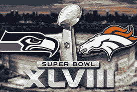

# 超级碗 48 和社会工程

> 原文：<https://www.social-engineer.com/super-bowl-48-and-social-engineering/>

社会工程师现在已经连续第二年利用超级碗的防御手段了。马修·米尔斯(Matthew Mills)是一名阴谋论者和独立记者，他在周日晚上的超级碗 XLVIII MVP 演讲中冲上讲台，对着麦克风说话，然后一名官员赶走了他。米尔斯声称他在进去的路上向几名保安出示了假证件而没有被拘留。米尔斯表现得自信而又时间紧迫，显然成功地愚弄了所有人。

2013 年，[两名萨凡纳州立大学的学生](https://savannahnow.com/news/2013-02-08/savannah-state-students-sneak-super-bowl#.UvAAL_ldWSo)偷偷溜进了新奥尔良的第四十七届超级碗，并录下了整个过程。这对搭档遇到了几次警察和保安，但最终还是设法进去看了中场表演。信心和权利感再次短路了人类的安全机器。

在一个角色中制造自信，并在面临威胁时保持这种自信是社会工程成功的关键。仅仅通过表现出你的归属感和自然的行为，你通常会解除别人的武装，减少更多表演或过多角色扮演的需要。简单往往是最好的！