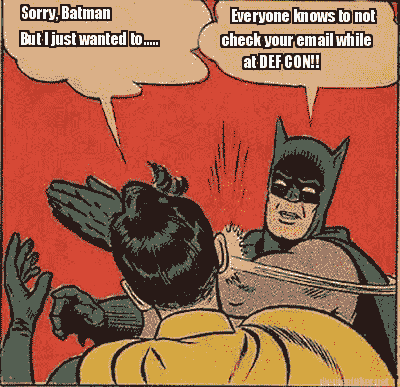

# 生存指南:黑帽与 DEF CON 22

> 原文：<https://www.social-engineer.org/event-updates/defcon-updates/survival-guide-black-hat-def-con-22/>

黑色 t 恤？检查。开锁工具？检查。
信用卡清道夫？检查。

我会说，有人正准备去拉斯维加斯参加黑帽和 DEF CON。想到另一个“安全第一”的博客，你们中的许多人可能会翻白眼。但是我们从事教育的人明白重复是游戏的名字。因此，无论你是经验丰富的专业人士还是这些活动的新手，请花一点时间确保你不会最终成为[绵羊墙](http://www.wallofsheep.com)。

黑帽和 DEF CON 是安全专家(née 黑客)来玩的地方。你一定会看到一些惊人的技术和人力开发。还会有一群人来做事情是因为他们能做，而不是因为他们应该做。

恶意的社会工程师可以打出一记重拳，因为他们可以将技术技能(这是你在 BH/DC 所期望的)与流畅的谈话和友好的面孔结合起来。因此，对于我们这些凡人来说，除了带上防晒霜和额外的肝脏之外，还有一些快速的事情要记住。

## 笔记本电脑安全

我们中的许多人习惯于在外出时与工作和家庭保持联系。如果你一定要带一台笔记本电脑，看在上帝的份上，确保它不包含个人数据、密码或任何你想丢失的东西，或者通过投影仪张贴在墙上让所有人看到的东西。确保您的补丁程序和防病毒软件是最新的。如果你只是需要笔记本电脑工作，关掉你的 wifi 和蓝牙。如果你必须连接，尝试找到一个有线连接，或者更好的是，带上你自己的移动连接。

然而，作为经常旅行的人，我们知道有线连接越来越少成为一种选择。下一个最好的方法是通过 VPN 连接到一个已知良好的网络。最后一部分在维加斯将会很有挑战性，因为即使是合法的网络也会被入侵。

尽可能不要在维加斯登录任何重要(如金融)账户。最后，如果出于某种原因弹出窗口要求您接受证书，运行，不接受，关闭并停止您正在做的事情。

## 手机管理

手机安全很容易成为和笔记本电脑安全一样大的问题。基本上，你应该像对待笔记本电脑一样对待你的手机。为了最安全，禁用蓝牙和 wifi。不要回复来历不明的短信或电话。假设你说的话和发的短信都在被窃听(谢谢 NSA)。

## 通信安全

希望你为你是谁，你做了什么，你取得了什么成就感到骄傲。小心你告诉的人..毫无疑问，这两个会议是联系和联络的绝佳机会。但是很明显，你需要注意还有谁可能在关注你的谈话，尤其是在社交活动开始的时候。

记住恶意的社会工程师可以在团队中工作也是很好的。如果你向不止一个人提供了一条微小的关键信息，那可能会给你以后带来大问题。

确保你的同事和家人知道你在哪里，以及你是否/如何联系他们是个好主意。对你有一点点了解的攻击者可能会利用毫无防备的同事、朋友和家人。

## 人身担保

这些习惯在拉斯维加斯之外也是常识。在旅途中，要小心处理包含您个人身份信息(PII)的文件和其他物品，如收据，甚至是包含您房间钥匙和号码的小文件夹。只要有人知道你的名字和房间号，就可以在前台冒充你，重新得到一把房间钥匙。

考虑相信酒店的安全吗？也许你需要看几段视频，看看破解它们有多容易([http://youtu.be/vW7M84khZy8](https://youtu.be/vW7M84khZy8))。在商户或自动取款机上使用您的信用卡/借记卡时要格外小心。吝啬鬼可能比比皆是——回家后密切监控你的账户也没什么坏处。

## 不要做低垂的果实

最后，批判性地思考你的环境和你正在做的事情。有很多恶意攻击者从损害最棘手的技术和人类系统中得到乐趣。但是和其他人一样，大多数人只会摘最容易摘到的果子。

尽管 BH/DC 充满了奇迹和荣耀，但对于那些没有花时间准备和没有仔细考虑他们的选择的人来说，这可能是一个充满敌意的环境。

也就是说，祝你玩得开心，来 [SE 村看我们吧！](https://www.social-engineer.org/social-engineer-village/)