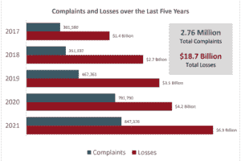
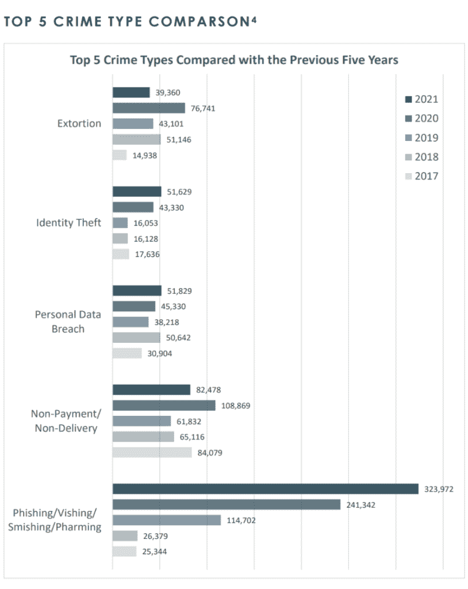

# 联邦调查局告诉我:分析联邦调查局的网络犯罪报告

> 原文：<https://www.social-engineer.com/the-fbi-told-me-analyzing-the-fbis-cyber-crime-report/>

当你是一个提供有价值服务的供应商时，你会寻找帮助公司的机会。有时，供应商的声明可能被夸大，甚至是捏造的。因此，我们引用可信的第三方数据来说明我们的观点。本月，我们将利用联邦调查局的年度互联网犯罪报告来展示美国社会工程攻击的持续增长，特别是通过语音钓鱼，或者通常所说的视觉。

联邦调查局的互联网犯罪投诉中心每年跟踪网络犯罪投诉和数据，并与前五年的结果进行比较。正如人们所料，投诉数量和网络犯罪造成的经济损失每年都在增加。

<figure id="attachment_106546" aria-describedby="caption-attachment-106546" style="width: 300px" class="wp-caption aligncenter">

<figcaption id="caption-attachment-106546" class="wp-caption-text">*Figure 1: Increase in Complaints and Financial Loss*</figcaption>

</figure>

该报告将犯罪类型分为 30 个不同的类别，包括拒绝服务、计算机入侵和赌博。然而，大多数可能被认为是骗局或社会工程相关。在这些骗局中，联邦调查局包括浪漫骗局、租赁骗局和最大的一类，钓鱼/伪装/欺骗/域欺骗。

## 社会工程是最大的风险

这张联邦调查局的报告图表显示了社会工程类别的重要性超过了接下来的四种最常见的犯罪类型。

<figure id="attachment_106555" aria-describedby="caption-attachment-106555" style="width: 450px" class="wp-caption aligncenter">

<figcaption id="caption-attachment-106555" class="wp-caption-text">*Figure 2: Top Five Most Common Internet Crimes*</figcaption>

</figure>

大多数人都知道网络钓鱼是一种恶意攻击，通常来自电子邮件等消息服务。视觉是语音钓鱼，攻击者试图通过电话引出敏感信息或行为。短信类似于网络钓鱼，但使用 SMS 或文本消息。

最后一类，域欺骗，可能很难理解它与网络钓鱼的区别，因为两者通常都包含窃取数据的相似或伪造的网页。两者的真正区别在于受害者如何到达页面。在网络钓鱼中，受害者会被某种类型的消息(通常是电子邮件)引导到数据窃取页面。在域欺骗攻击中，受害者将被动地到达页面，例如通过搜索结果、购买广告或水坑攻击。攻击不是通过电子邮件或文本等信息来瞄准目标，而是被动地进行，让感兴趣且不知情的受害者走进来。

## 社会工程隐藏的一面

联邦调查局的报告还包括其他攻击类型，包括商业电子邮件危害(BEC)和勒索软件。这是我们经常听到的另外两种攻击媒介。这些都是对企业攻击的合理担忧，也让安全从业者夜不能寐。但是，它们有一个经常被忽略的方面，即这些攻击的初始媒介。攻击者如何从企业高管的邮件帐户内部发送电子邮件？攻击者如何获得足够的网络访问权限来安装勒索软件？最初的威胁媒介通常是通过社会工程。

攻击者可能会使用网络钓鱼电子邮件来获取邮箱的密码。一旦进入受害者的邮箱，攻击者就可以在公司内部发送可信的电子邮件。如果你的工作是支付发票，首席财务官从他们的公司账户给你发了一封电子邮件，要求你支付发票，你可能会这样做。如果一位高层管理人员发送一封电子邮件，询问有关员工、薪水、客户或最新项目的信息，收件人会信任这封邮件并做出回复。这就是 BEC 对公司的毁灭性打击。

##### 恶意软件和勒索软件

恶意软件和勒索软件也经常会通过社会工程找到立足点。攻击者可能试图将恶意软件附加到电子邮件中，但现代电子邮件过滤器在阻止这些攻击方面做得更好。另一种途径是在受害者点击链接后从网站加载恶意软件。

##### 技术支持欺诈(TSF)

攻击者使用的第三种方法是通过 FBI 所谓的技术支持欺诈(TSF)。在过去的五年里，联邦调查局报告说，TSF 的财务损失从 2017 年的 1400 万美元大幅增加到 2021 年的 3.47 亿美元以上。TSF 在恶意软件和勒索软件感染中发挥作用的方式是，攻击者将员工称为 IT 部门的受信任成员，并让员工在其计算机上安装远程访问软件。一旦安装了软件，攻击者就可以完全访问工作站，就像坐在员工的座位上一样。然后，攻击者可以安装勒索软件，迫使它在网络中传播，锁定公司内的重要资源。

## 教育和测试你的员工

我们知道网络安全入侵是一个问题，这份联邦调查局的报告表明它们正在增加。过去几年的问题是在软件和缺乏更新和补丁，现在他们更以人为基础。IT 部门在加强网络抵御技术攻击方面做得非常出色。然而，公司现在需要更加关注员工。公司需要更加关注对人类攻击媒介的教育和测试。正如联邦调查局的报告所显示的，社会工程目前是最大的风险，而且还在增加。

为了测试您的员工抵御[视觉攻击](https://www.social-engineer.com/managed-services/managed-vishing-service/)和[网络钓鱼](https://www.social-engineer.com/managed-services/managed-phishing-service/)攻击，甚至来自[现场物理访问危害](https://www.social-engineer.com/managed-services/social-engineering-security-assessments/)看看 [Social-Engineer，LLC](https://www.social-engineer.com/) 如何帮助您。

在 Social Engineer LLC，我们的目标是为所有技术用户提供教育和认知。有关我们服务的详细列表以及我们如何帮助您实现信息/网络安全目标，请访问:

**[【https://www.Social-Engineer.com/Managed-Services/.】](https://www.Social-Engineer.com/Managed-Services/.)**