# 人类黑客大会:阿尔法年

> 原文：<https://www.social-engineer.org/event-updates/sevillage/the-human-hacking-conference-year-alpha/>

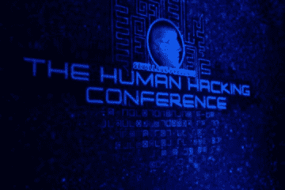

早在 2019 年，我们就开始暗示我们正在进行一些大项目。 期待很高when在6 月我们发布了一个激动人心的公告。Social-Engineer.org沿着与前行，LLC 本来打算先上演自己的，自产自销，发布会；塞维利亚呈现:人类黑客大会 (HHC) 。T38

这个 以前从未见过的 发布会将会与众不同。 这一包罗万象的活动向商业、安全、技术和心理学专业人士 传授最新的技术和技巧 来自各自领域的顶尖专家。 宣布了车间教员的名字 、 ，每一个名字都让人兴奋不已。在人类欺骗、身体语言分析、认知敏捷性和智力研究方面的专家 、 的参与下，这一事件逐渐成为 2020 年最激动人心的事件。对于那些无法参加、 和那些想重温体验的人， 别担心，我们找到了你们！继续阅读人类黑客大会的所有细节:阿尔法年！T37】

## **周四——黑掉了、****Pent****est****ing****，红色组队还有更多！**

人类黑客大会于 2 月 20 日周四凌晨拉开帷幕。开始的兴奋是很高的。以至于我们有一位与会者 从早上 6 点 就已经在会议区等候了！ 报名和一些茶点之后，就到了踢 f 开幕式的时间了！我们的首席人类黑客克里斯·哈德纳吉(Chris Hadnagy)通过提醒我们【HHC 的核心价值观】*【让他们因遇见你而感觉更好】* 来引领这场活动。

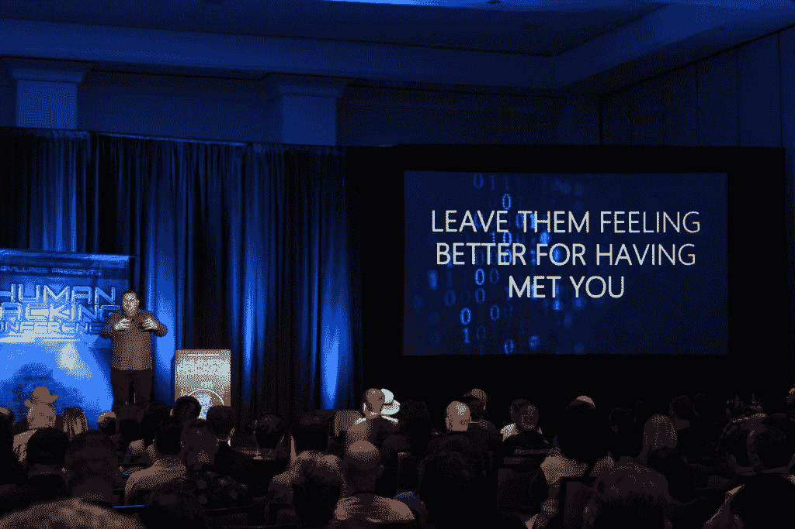

## **赛道 1:黑客入侵 C-Level &商业**

在娱乐和振奋人心的开幕式后，我们的参与者分开前往他们选择的赛道。周四 提供了两个演讲曲目。第一轨道是“黑进 C-Level &的生意”，从我们的 朋友佩里·卡彭特开始，他是我们 HHC 赞助商[know 4](https://www.knowbe4.com/)的代言人。作为首席传道者& 战略 知识官 ，佩里可以就他的课题*驾驶安全行为的艺术与科学**c**e 给出一些合理的建议。*

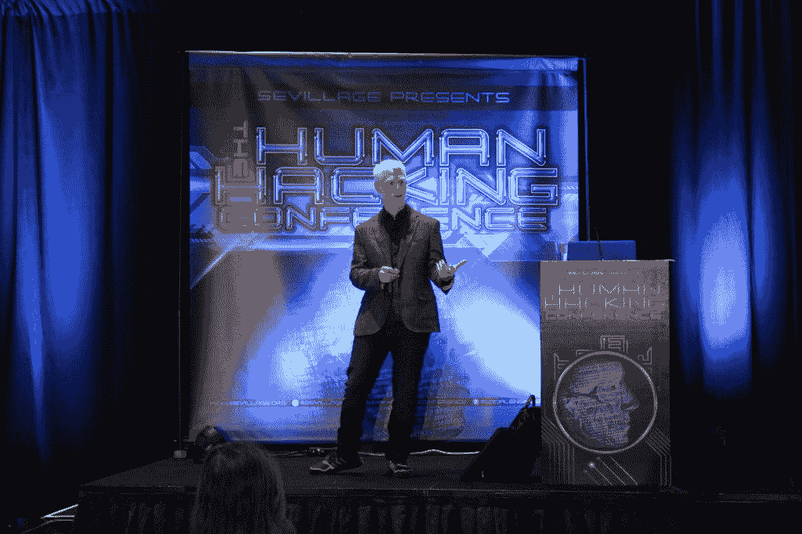

那个 是 接着是 社会工程师有限责任公司受人爱戴的销售总监杰伊·科尔皮。 杰伦的风趣和轻松愉快的个性随着他的演讲得到了充分的发挥， *异军突起**fr**om**保管工程师到 CEO 并买下了整个 14 层**楼层* 。我是说，看看那个领结。T38

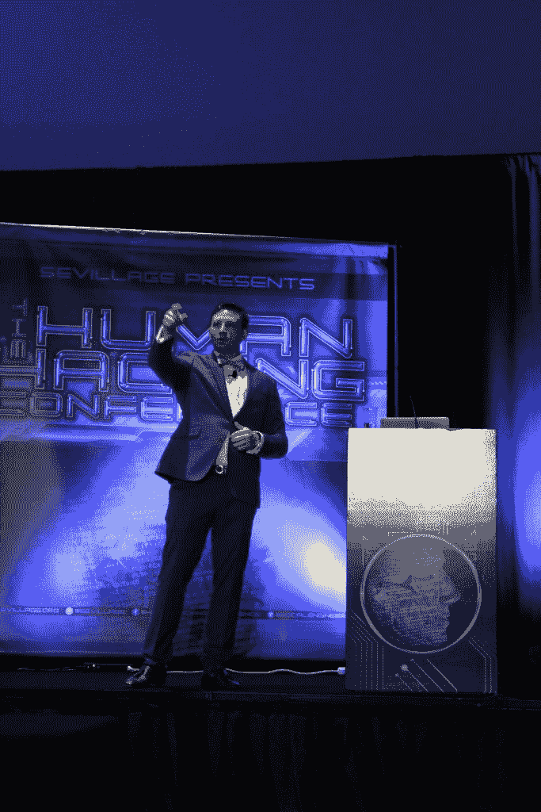

下一位是多米尼·克拉克，他是【】T2】首席执行官【&布莱克米尔 咨询公司的创始人。她谈到了 *黑客入侵高管层……最终解密:高管如何搜索 F**I**rms 渗透进高管层，让 Talen**t**叛逃，并改变全球业务的进程* 。w. Domini 用这个话题吸引了她的观众，这有助于 T35、T36、m、T37、T38 了解到一个高管的聘用是如何改变整个组织的轨迹的。

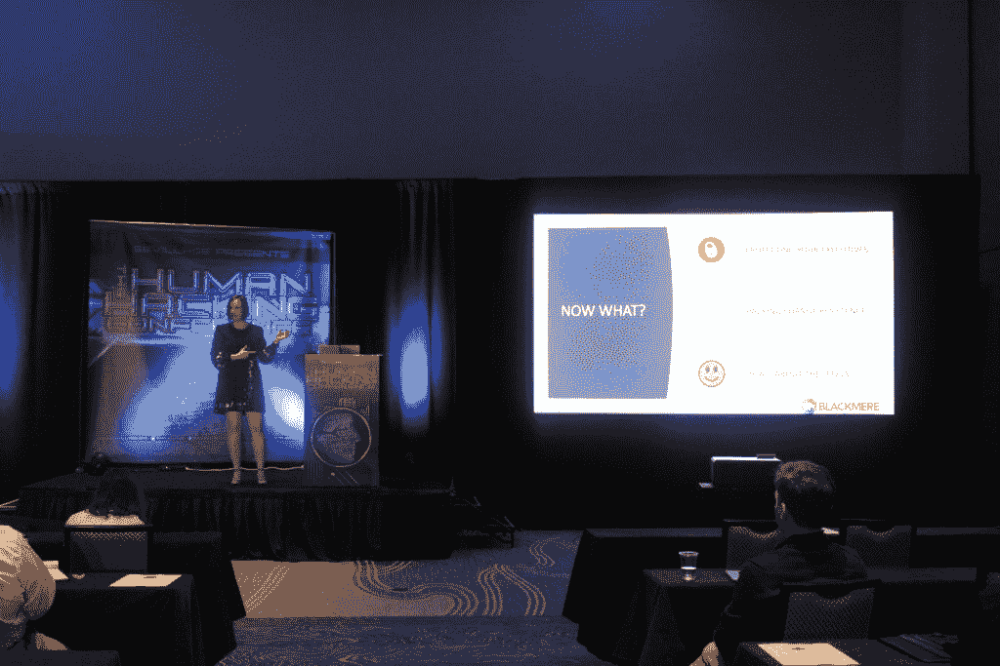T4】

第一场的最后一位是 Chris Hadnagy，我们都知道他是 Social-Engineer，LLC 的创始人兼首席执行官。他谈到了*S**E**E**你团队中的潜力*这凸显了 了解你的团队及其沟通风格的重要性。他还掉了一些素质 DT32】IT34】lbert 的漫画。T37】

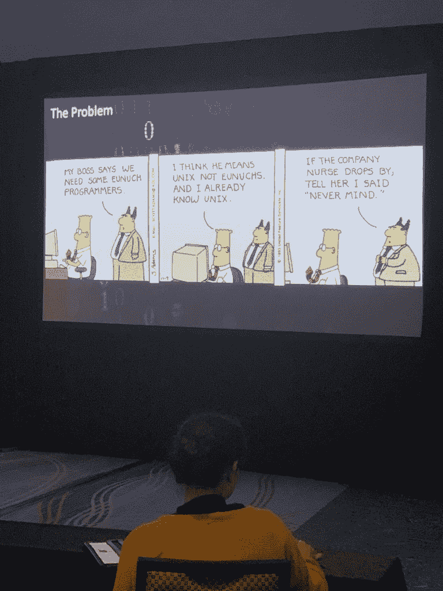

## **曲目 2:** **五旬节**

在这一切发生的同时， 跟踪 2 同时 运行测试机架。开启这条赛道的是 Social-Engineer 的首席运营官 Ryan MacDougall。 他的 题目 是 *哪个五旬节适合你* *。* Ryan 强调了每个公司如何确定哪个测试适合他们的 安全 需求以及他们如何使其有益于公司需求。

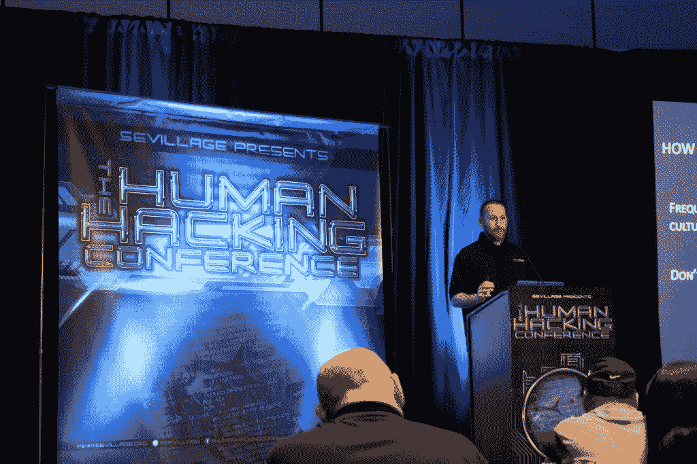

我们有史以来第一位 SECTF 选手来到 HHC，与我们一起讨论 *主动措施。* 韦纳森 是 从循环安全 。 他精彩的演讲 呈现了一场现场模拟攻击，从黑客的角度展示了事情。 何 演示 ed 社会工程钓鱼攻击如何演变成完全民族国家风格的攻击 。该演示向与会者展示了他们的组织如何容易受到和 攻击，以及攻击如何会破坏毫无准备的业务。T34

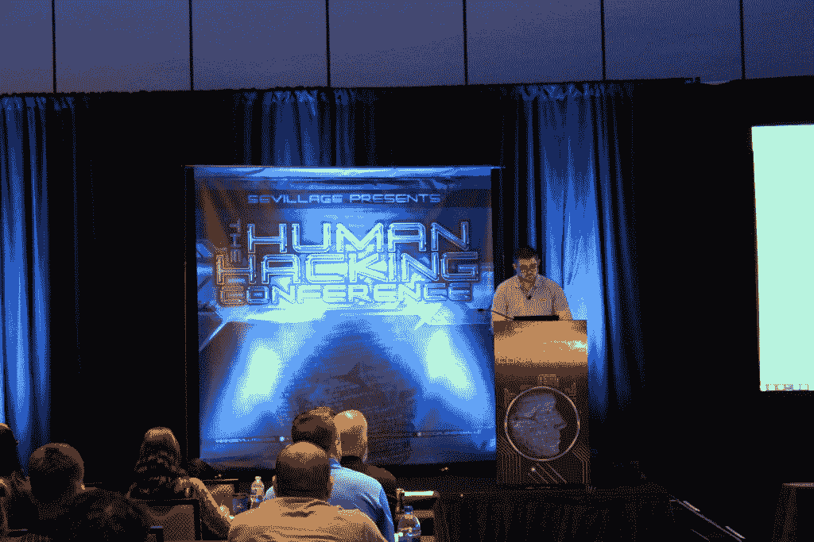

完成完五旬节我们的一位非常要好的朋友 和 HHC 的赞助商 Chris Silvers谈到了 *缩放费西合唱团:* *五旬节* *这个 SMB。* Silvers 是 [CG Silvers Consulting](https://www.cgsilvers.com/) 、 的创始人，他给大家上了一堂课，告诉大家如何以及如何不将您的安全思维从企业扩展到中小型业务环境。T34

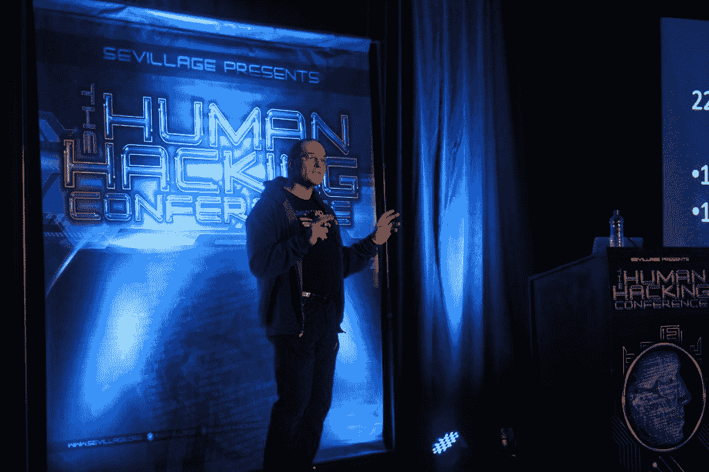

当赛道接近尾声时，每个参加的人都享受到了 的自助午餐，那是一种只有照片才能描述的美妙。 这些午餐是在 HHC 、s、 三天里提供给所有在那里的吃货们的，尽情享用吧。

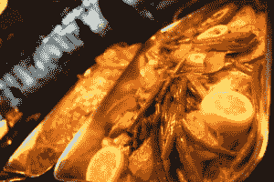T6】

## **第一轨:第二部**

在 馆 吃了一顿不可思议的联谊午餐后，我们的与会者与食物搏斗昏迷头 ed 回到我们演讲的轨道上 一些 惊人的演讲 持续了一下午 。 追踪 1 恢复 其 窃听 C-Level &商业主题同 罗伯特·迪安。迪安是德勤 、 的网络看门人，是 HHC 的赞助商。他的讨论题目是 *梅花之二。* 这个演示突出了一个 v各种入门级 l 资源，这些资源是非技术性的、低成本的，并且对个人和组织公开可用。通过鼓励他们研究自己的意识和个人安全，他鼓励所有人致力于激发对逻辑和物理安全价值的更深层次的组织讨论。T52

接着，舞台准备迎接最热情的力量——斯黛芬妮·保罗。 斯蒂芬妮 是斯黛芬妮·保罗 、 公司的创始人，是我们见过的最有活力的人类之一 。除了在 HHC 做一名 工作坊 培训师之外(更多内容请见下文！) 、 她还讨论过 *窃听到“为什么”的故事作品* 。她这次演讲的口号是“讲故事——因为你的生理受其支配！” ， 她的话题让观众着迷，这证明了这一点。如此入迷，以至于在我们任何人意识到它已经发生之前，谈话就超时了！T32

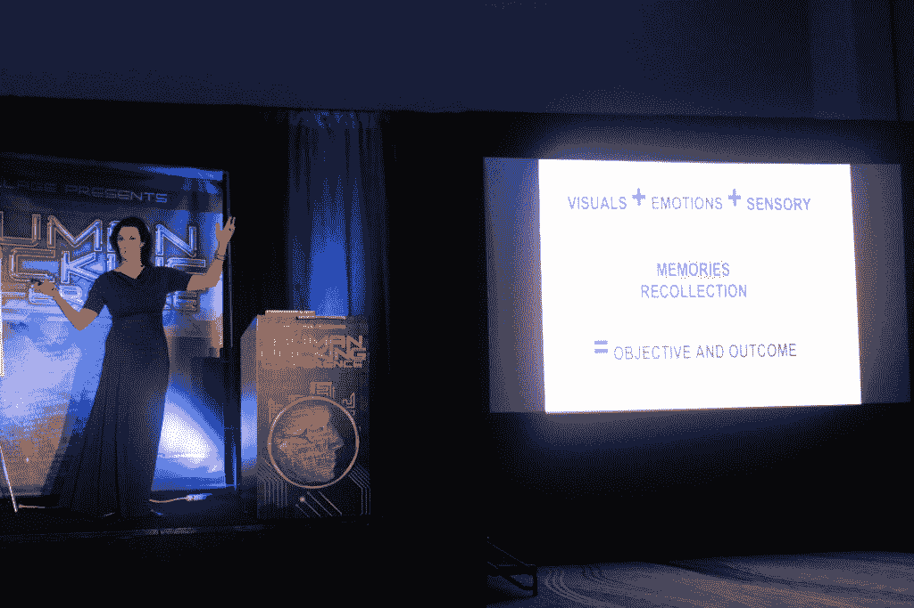   

商业发展专家艾丽·汉森跟进了这一行动。 【艾莉】 ， 有着 10 年从业经验，他向观众们讲述了 社会工程原理如何成功运用于业务发展 ， 以及应用这些原理对你的公司意味着什么。

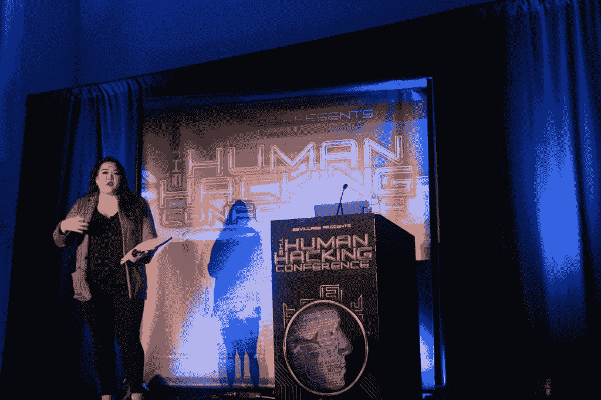

最后，我们请到了应用行为研究公司的首席执行官蔡斯·休斯。他的演讲 *人的因素* 突出了 ed 人的行为几乎是决定我们所有的成败的因素。蔡斯教了 tac tics，它可以应用在任何对话中，不仅能读懂一个人，还能影响他们。

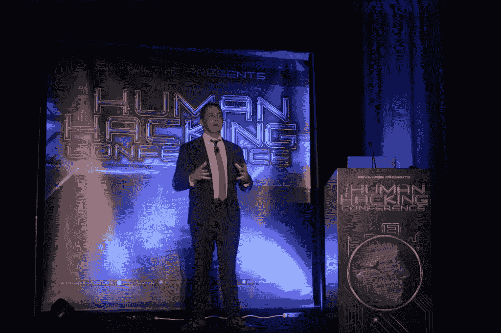   

## **赛道 2:红色组队**

第二跑道成为了下午的红色组队跑道，它由赤焰松·雷诺兹拉开序幕。赤焰松是阿瑟社会工程师有限责任公司的顾问。她的技能不仅可以让克里斯·哈德纳吉(Chris Hadnagy)永远烦恼，还可以在学习量子计算的同时进行测试。 赤焰松谈到了 *的性格、看法和说服力*解开纠结 运气来自技巧和看图 ed 看什么 形状 我们对彼此的看法。

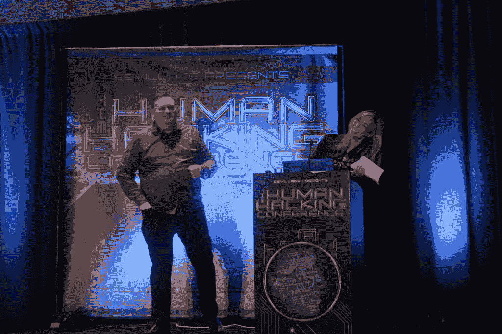

Ryan MacDougall 发表了他今天的第二个演讲，这是在 *SE 队对 Red 队* 的比赛中。他的演讲探讨了什么是 SE 团队 、 以及它与 red 团队有何不同。 这次演讲之后，Wayne Ronaldson 发表了第二次演讲，他强调了这些团队的重要性。他的 演讲 、 *国家的敌人* 讨论并演示了一个老练的对手试图利用分层攻击向量来解释真实攻击的影响，从而锁定商业智能。

今天第二条赛道是社会工程有限责任公司的技术运营总监杰里米·多德森。他讲的 是 *解剖红队* 。 内部红队可以成为任何公司安全态势的有力工具。Jeremy 的演讲帮助听众更好地理解了一个内部团队的好处和局限性。它还 突出了 为什么以及何时寻求外部红队 s 服务。T31】

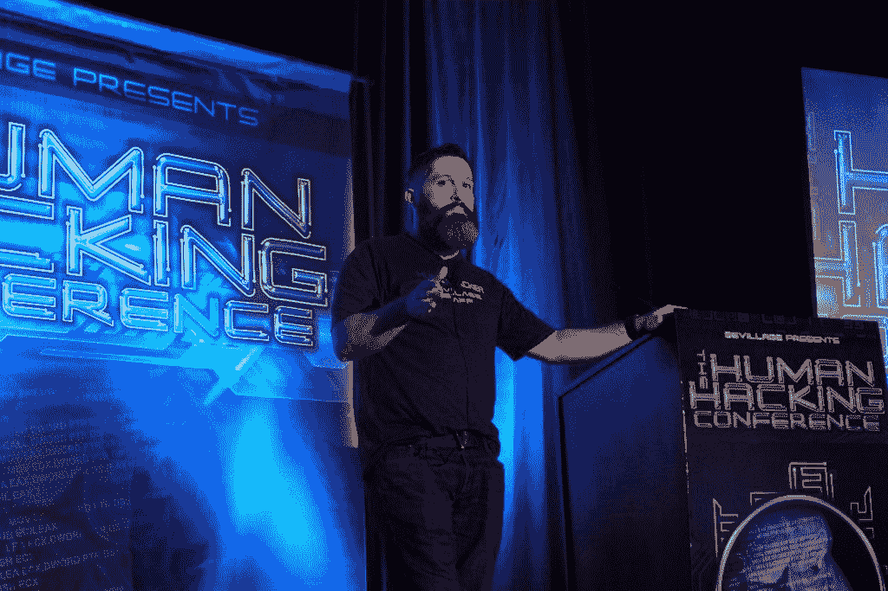

## **社会工程面板**

为了结束 HHC 的第一天，我们邀请了一些车间培训师与 Chris Hadnagy 坐下来进行一系列闪电访谈。R·保罗·威尔逊、阿曼达·柏林、尼克·弗诺、斯黛芬妮·保罗和乔·纳瓦罗 、 轮流回答 的问题，并强调在他们的工作室里会有什么。These轻松愉快的 和 扣人心弦的 采访 s 成了我们出席者一天中最喜欢的部分 。T32

集锦出自第 正段有:

*   保罗是唯一一位没有得到克里斯 拥抱的 嘉宾，他还特意指出了这一点

*   Nick Furneaux 与克里斯 度假时的趣事
*   斯黛芬妮·保罗是被采访时最有活力的人
*   阿曼达·柏林是一个了不起的人 她创造了一个围绕精神健康的完整基础
*   乔·纳瓦罗是 一个 迷人的人而 这位 观众 s 只是吸收了 他要说的一切。   

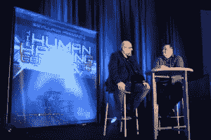T3】

   

 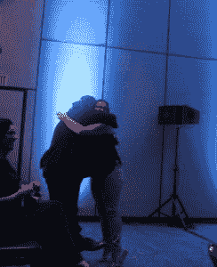

## **德勤** 主办的晚间活动

我们周四晚上的活动由我们慷慨的赞助商[德勤](https://www2.deloitte.com/us/en.html)主办。工作人员和与会者都很高兴有【Pepper】这个 人形 机器人在那里。 Pepper 通过跳舞、唱歌、自拍等方式娱乐人群。非常感谢德勤主持今晚的活动，并把 Pepper 带到人类黑客大会！

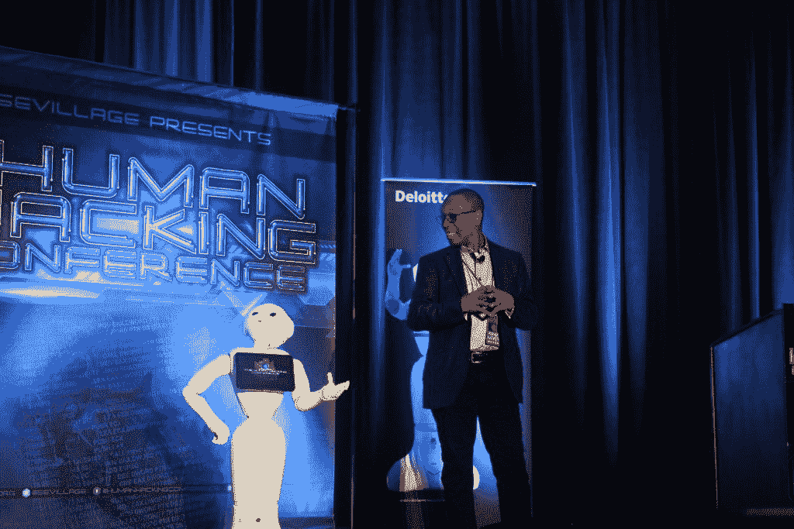   

## **星期五——参观、车间和逃生室！T3T5】**

周五上午 9 点，Chris Hadnagy 发表了主题演讲。他的主题是 *下一个最大的社会工程矢量* 。 虽然多年来我们一直把重点放在 p hishing 作为 的主要攻击载体，vishing 正在变得比以往更加危险。为了突出这一点，Shelby Dacko，一位社会工程师有限责任公司的专业摄影师，和 Chris 一起上台做了现场演示。走进 一个 隔音 展台， 同一家 我们用的为何 S ECTF ，谢尔比叫了一家知名的汽车租赁公司 。仅仅通过一个持续了 10 分钟的电话，她就获得了 10 面旗子。很快就明白了为什么她在公司里的绰号是“可怕的小人类”。(pssst，这也正好是她的[推特手柄](https://twitter.com/scarylilhuman/)。)

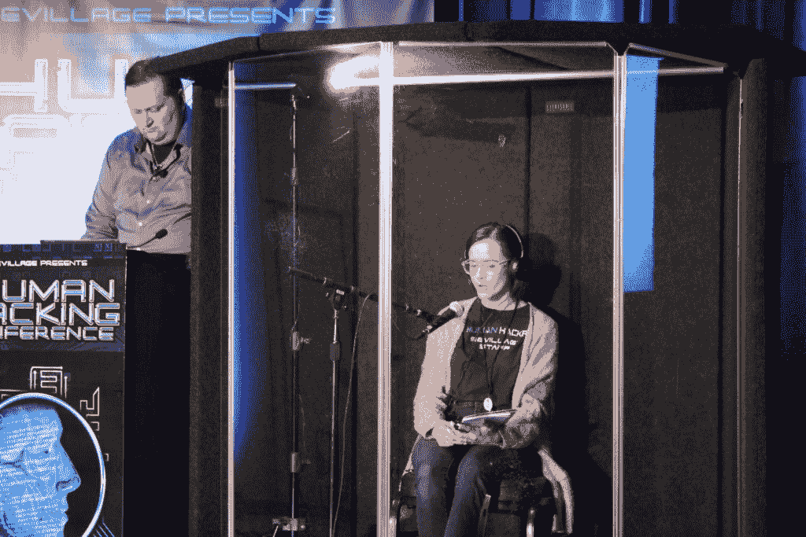   

随着大家对他们刚刚目睹的的热烈讨论，他们去了 HHC 的第一个车间。星期五是 4 个不同研讨会的所在地，每个与会者可以在注册时选择。

### **乔·纳瓦罗**

见过乔的人都知道他是 超级卑微的 。你永远不会知道他掌握了多少知识。 但是 那些拿了他的工作间的人很快就了解到 他要开出多少价码。我们收到了大量的回复，他们说乔的工作室改变了他们的生活。

乔曾担任联邦调查局特工，专门从事行为评估长达 25 年。他已经写了 13 本书，其中一本讲述了他如何成功抓住一名国际间谍的故事。(说真的，退房 [*还有三分钟就到末日了*](https://www.amazon.com/Three-Minutes-Doomsday-Traitor-Espionage/dp/1501128272) ，你不会后悔的！)他也是社会工程师播客的常客。乔的关于 *非语言交流的工作坊* 强调了肢体语言是如何被用来评估所说的话以及 被 感受到的。 一位研讨会参与者在人类黑客大会上参加了乔的研讨会后告诉我们，“ 乔教授的东西是物质的，有影响力的，因为它们是人类状况的一部分，有趣，最重要的是，在工作和日常生活中也是可用和可行的 。”

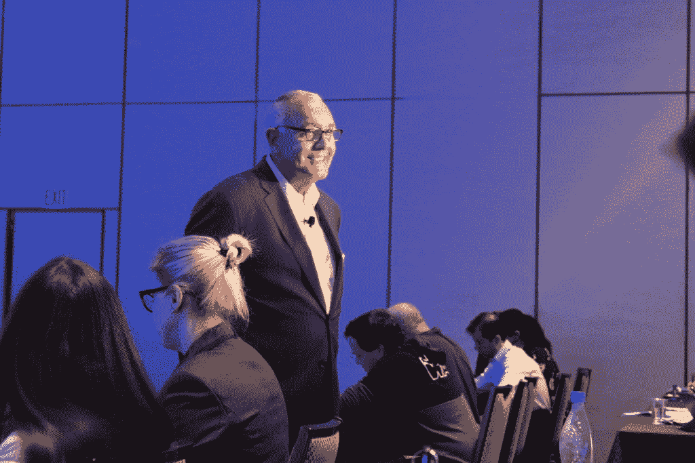T4】

### **Dov****T5】男爵**

多夫 不仅是一股不可忽视的力量，他还是一个有影响力的人。每个见过 Dov w 的人都会瞬间被 他充满活力的个性所吸引。那些上过他的课的人感觉到了这一点，甚至更多。Dov 已经在国际上发表了超过 30 年的关于不断发展的领导世界的演讲。他的工作广为人知，两次被 Inc .杂志评为 100 位最佳领导力演讲者之一。Beyond 是 ing 几本书的畅销书作者， 他还主持研讨会 *如何在人工智能时代茁壮成长！2030 年的领导技能。*

Dov 的 工作坊专注于人类动力和驱动所有人类实现目标的隐藏力量。据预测，未来 15 年，40%的人将被自动化取代， Dov 专注于 在人工智能时代茁壮成长。他还关注如何与任何人建立关系，并获得新的成功底线。

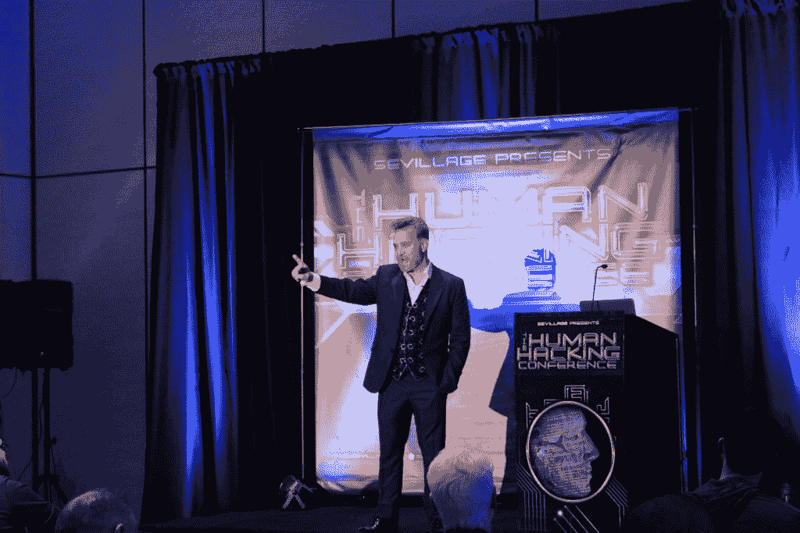
T3】

尼克不仅是社会工程师家庭的终身朋友，还是网络安全和数字取证方面备受尊敬的专家。25 年来，尼克一直为英国、欧洲、美国等地的公司和执法机构提供咨询服务。他的专长包括 advan ced 开源情报(OSINT)收集技术、加密货币犯罪和 RAM 分析。 尼克还写了[*Invest**igat**ing 加密货币*](https://www.amazon.com/Investigating-Cryptocurrencies-Understanding-Extracting-Blockchain/dp/1119480582) 这是世界上唯一一本教授 c 加密货币犯罪侦查技巧的书。

尼克的工作间是 *你能找到* *牙刷吗？* 、 其中与口腔保健无关。他的班级教调查者透过表面现象看问题，这样他们就能看到在网上调查时容易被忽略的情报。研讨会不仅提供了实用的方法，让他们可以看到数据背后的数据，还推断出许多 研究人员遗漏的证据。我们人类黑客大会的一位与会者热情地告诉我们，“尼克的课太棒了。他很容易倾听，是一个非常互动的培训师。他是唯一一位让我对学习数学感兴趣的老师！”

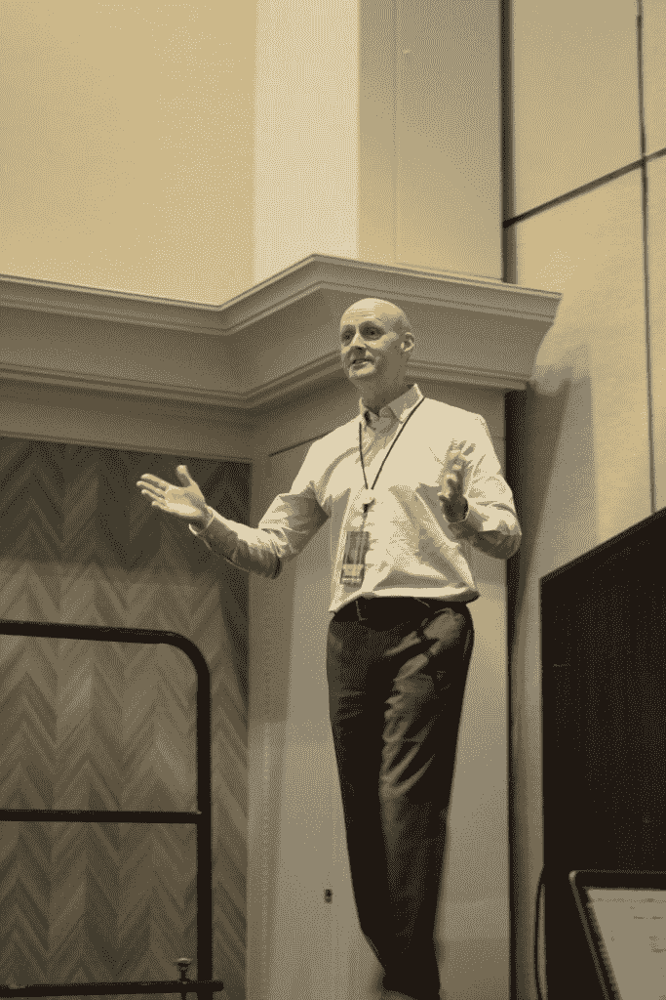T4】

### 保罗·威尔逊

拥有精英骗子、魔术师和电影制作人等头衔，保罗做到了这一切。他比历史上任何一个人都更擅长诈骗游戏他是诈骗和骗局的最顶尖专家 s . r . Paul’他的经验使他成为了骗子在操纵受害者时如何思考和行动的专家。这是社会工程最强大的力量。

R. Paul 来到 HHC 教那些参加过他的工作坊的人魔术师和骗子是如何思考的 。他教 如何 理解 ing 欺骗 可以 揭示无数 运筹帷幄 es 可以应用于 verba l 和 心理操纵 。 他的作坊 *黑暗之手* 收录了专家的欺骗使用技巧和sleight之手。上过他的课的人在离开时说，“它让你的思维开阔，既能面对现实的可能性，又能应对任何意义上的‘观众’的期望。”

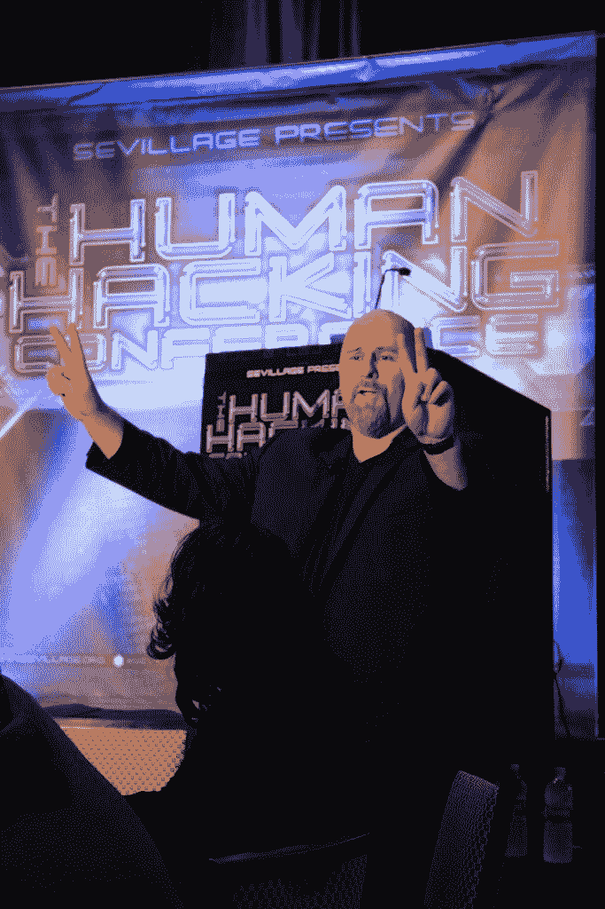
T3】

## **社会工程面板——万物融洽**

似乎今天的研讨会还不够，今天还计划了另一个社会工程小组。与 多夫 巴伦、罗宾 德雷克 和布兰妮·考德威尔坐在一起，我们的主持人克里斯·哈德纳吉就 社会工程和融洽关系采访了他们。这次谈话对所有人都很有启发，因为他们学会了融洽如何融入生活的方方面面。 这个小组中我们最喜欢的一个时刻是Robin 和 Dov 讨论如何利用融洽关系发展牢固关系的时候。 以 HHC 为例，他们强调了克里斯如何能够 利用 的融洽关系，不仅与 这些专家 在他们的 领域形成关系，而且 让他们聚集在一起，形成了这个不可思议的事件。听到这里，我们的主人可能流了几滴眼泪，但他也可能只是在切洋葱。T38

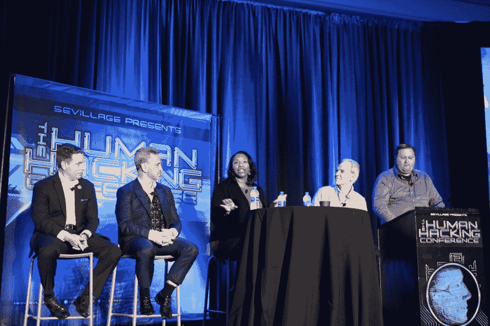   

## **晚间活动由生活保障主办**

人类黑客大会的第二场晚间活动由[生活安全](https://livingsecurity.com/)主持，他也是赞助商之一。 y 创造 游戏改变体验，帮助提供安全意识培训。当我们说“改变游戏规则”时，我们是认真的！他们为我们的晚会带来了两个逃生室游戏。这些逃生室对每个人来说都很有趣。

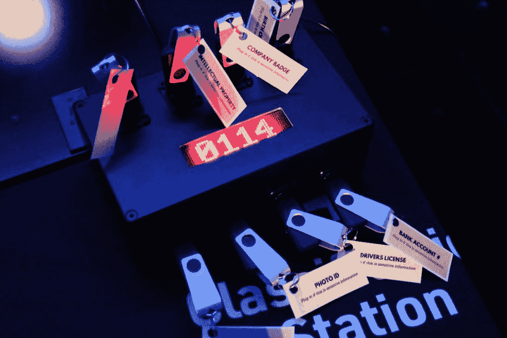   

## **周六——更乔、工作坊、闭幕式**

周六，乔·纳瓦罗以 *【你从没学过的人际交往五件事】* 开始了我们的主题演讲。 继他的 售罄 工作坊 前一天 、 这个基调给了大家从乔那里学习 为自己服务的能力。 我们的一位与会者谈到他从乔那里了解到的信息时说，“ 乔非常优秀。听完他的演讲后，人们看得更加有趣了。”

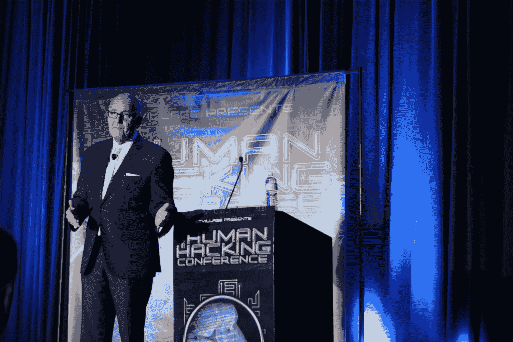T4】

周六还提供了 5 个不同的研讨会，与会者能够 参加 。

### **伊恩罗兰**

伊恩是冷读领域的顶尖专家，以“心灵人”而闻名。通过教授在生活和商业中有实际益处的惊人的、变革性的思维技能，帮助人们和公司取得更大的成功。他是第一个也是唯一一个来自美国的人，受雇于美国联邦调查局，被要求教他们的外勤特工冷读和沟通技巧。

伊恩的 工作坊 *如何* *到* *成为通灵者* 解释并演示了“冷读”的艺术(对于那些怀疑它的人，伊恩将其描述为如何与完全陌生的人交谈，以便他们认为你是通灵者)。那些与会者能够学习如何对某人生活的任何方面做出自信的陈述，即使你对他们一无所知。它展示了如何将这些相同的交流技术应用到其他领域，如商业和销售。一名塞维利亚的工作人员说，自从研讨会 ， 以来，他一直在“试图决定如何最好地利用伊恩的作品来伪装和模仿。”

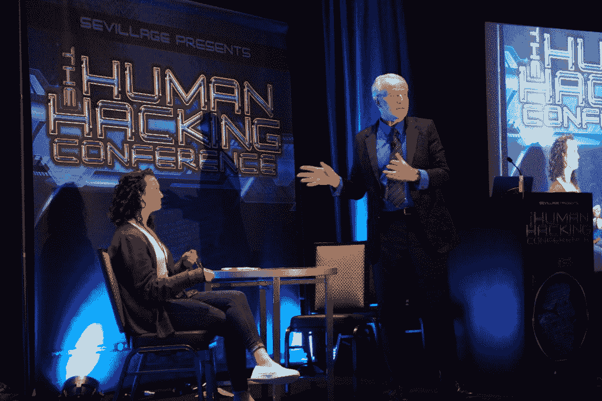

斯蒂芬妮很自信，并为自己的成就感到非常自豪。在过去的 29 年中，丰富多样的娱乐经历使她有能力在内部指导高管，销售 s 团队、 Tedx 演讲者等等。她还是一名令人印象深刻的演员、脱口秀、小品喜剧演员、导演、制片人、作家和公共演说家。

她的工作室被称为 *小心:利用有影响力的交流，勾引深刻的联系* 。从一开始， ， 斯蒂芬妮 ， s w 或 kshop 就极具娱乐性、趣味性和互动性。甚至在研讨会开始前 、 我们的与会者说她如何利用音乐和其他娱乐让每个人’s 能量 u p. 从那里斯蒂芬妮教简单的工具来帮助有效地导航沟通。她解释了为什么她在现实世界的娱乐交易工作中学到的技巧以及为什么它们如此有效。然后，她授权给她的听众，鼓励他们创新，塑造引人入胜的信息，以获得最大效果。

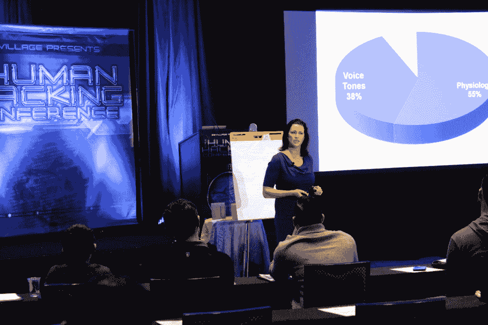   

### **罗宾** **德雷克**

罗宾 是首席执行官的人公式和行为 分析 专家。他 还帮助克里斯·哈德纳吉编写了 [高级实用社会工程](https://www.social-engineer.com/training-courses/advanced-practical-social-engineering-training/) 课程的练习册。 作为前联邦调查局特工和反间谍行为分析 Progr a m 的负责人，罗宾开始热衷于信任的力量。

罗宾的工作室， *信任的准则&看人* 是基于罗宾的生活工作和他的背景。它教会了 快速融洽的工具高层信任的手艺 。他的研究使他能够更深刻地理解关系的力量，以及这些关系是如何在生活的各个方面取得进步和向前发展的基石。

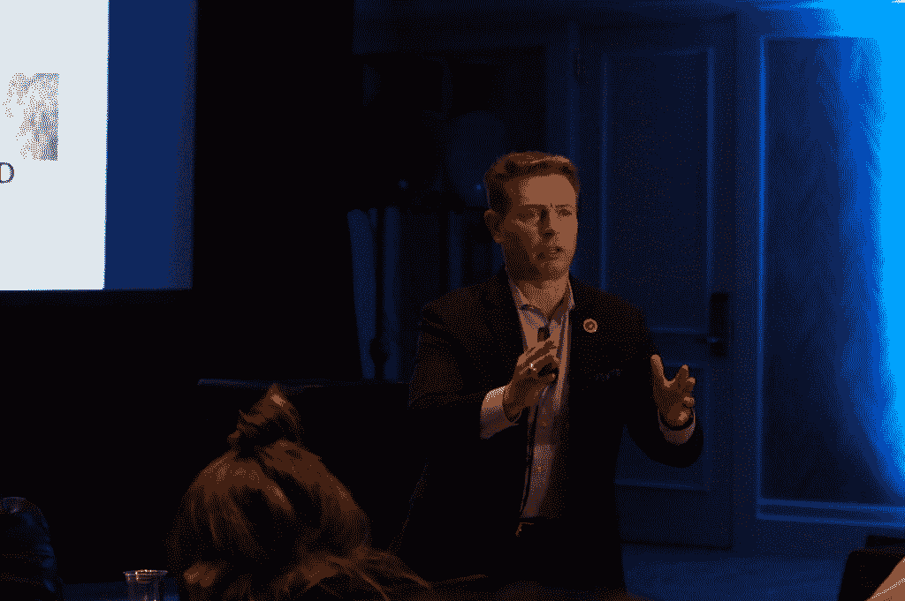
T3】

布兰妮是度假剧团的老板，自由职业演员、 剧作家和 导演。她还指导社会工程师有限责任公司的硕士水平的社会工程课程。有着 15 年经验的 、 布兰妮相信 s 在表演作为教学工具的力量。布兰妮利用她作为表演教练的技能，帮助促进公司和个人的专业培训，以提高他们自己的培训和演示技能。

布兰妮的工作室、 *演技* *像人:轻松黑客人类指南* *、* 使用了演员 、像她自己、 使用 的相同技巧，帮助她的学生在现实生活中感受自然和轻松。她教他们如何在身体、声音、精神和情感的各个方面对自己有更大的认识。一名学生说，“布兰妮的课确实为我们使用多少非言语行为提供了一个新的视角； 尤指身体摆放和手势。她授课的方式和课程的进展，显示了我们的话语可以带来多大的不同。尤其是当我们使用强调、缩写、上下文和情感时。”

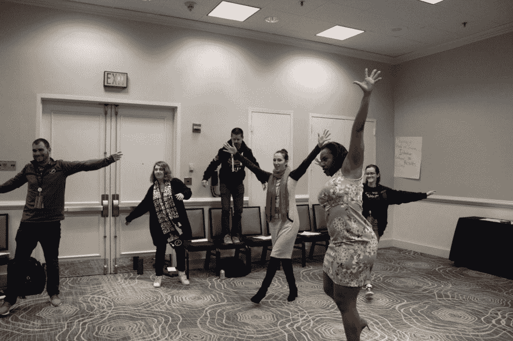   

### **阿曼达柏林**

阿曼达是 T2 布鲁米拉 T4 的高级安全分析师，也是 501(c)(3)非营利性心理健康黑客组织的首席执行官和所有者。Berlin 女士在不同的技术领域和部门工作了十多年，提供基础设施支持、分类和设计。

阿曼达对心理健康并不陌生。在经历了一段时间的个人奋斗后，她意识到她不仅不是一个人，还有一些资源可以帮助其他人。许多人可能会问，为什么一个心理健康研讨会在一个人类 黑客 会议 上举行？ 因为心理健康影响所有人，甚至安全专业人员。阿曼达的研讨会包括小组 练习和心理健康急救计划的内容。学生们带着对心理健康问题以及如何帮助他们周围的人的更好的理解离开了。一个上过阿曼达的课的学生评论道，阿曼达触及了我们这个时代，尤其是我们这个领域的一个重要问题。她给出了实用的练习来帮助你应对，以及如何和何时寻求帮助。”

## **闭幕式**

对我们所有人来说，HHC 的决赛来得太快了。对于社会工程师团队来说，闭幕式是一个 梦想的实现。关于举行我们自己的会议的讨论已经酝酿了多年，所以最终站在了它的终点，这是一个重大的 事件 。Chris Hadnagy 代表整个团队发言，并分享了一张幻灯片，强调了所有人的快乐时光。这个夜晚以美食、美酒和朋友们一起分享人类黑客大会的最后几个瞬间而结束。

当我们现在回想 HHC 时，这里有一些我们最喜欢的时刻:

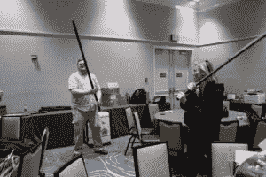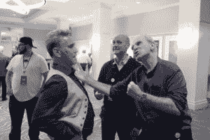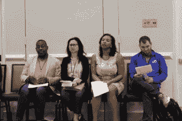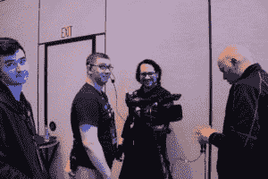T4】

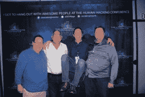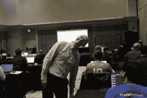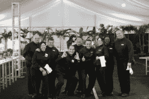T4】

## **人类黑客大会**

随着第一年的成功，社会工程师团队正在努力工作，计划我们的第二次人类黑客大会。我们将带回许多来自第一年的车间培训师和一些令人兴奋的新成员！我们已经很兴奋了 ， ，我们希望你们中的许多人能够加入我们！想知道什么时候吗？我们可以告诉你！日期是 3 月 11 日至 13 日在佛罗里达州奥兰多！在 [社交媒体](https://twitter.com/sevillage) 上关注我们，获取所有更新。

非常感谢你！赞助人类黑客大会的有[know 4](https://www.knowbe4.com/)、 [Deloitte](https://www2.deloitte.com/us/en.html) 、 [PlexTrac](https://plextrac.com/) 、 [Living Security](https://livingsecurity.com/) 和 [CG Silvers Consulting](https://www.cgsilvers.com/) 。还有我们的合作伙伴[、赛博威尔](https://mc.thecyberwire.com/hackinghumanconf2020)、[四月制作](https://www.fourmoon.com/)和[我的好眼睛。没有你们所有人，这次活动是不可能的。](http://www.mgenyc.com/)

所有照片拍摄者:阿玛亚·哈德纳吉和泰勒·多德森 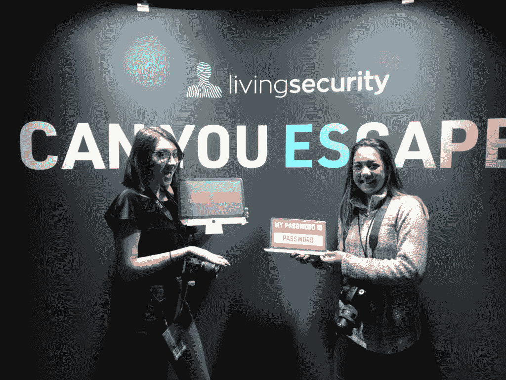 

来源:  