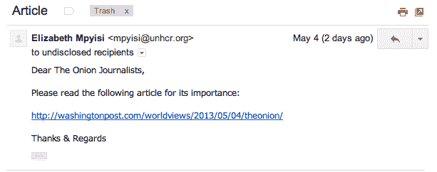

# 洋葱被切碎了

> 原文：<https://www.social-engineer.org/general-blog/the-onion-gets-hacked/>

互联网上最受欢迎的恶搞新闻网站 The Onion 最近成为了黑客攻击的受害者，他们的谷歌公司账户和推特账户都遭到了攻击。他们被叙利亚电子军(SEA)黑了。【你可能听说过海。]他们就是那个[侵入美联社推特账户](https://www.telegraph.co.uk/finance/markets/10013768/Bogus-AP-tweet-about-explosion-at-the-White-House-wipes-billions-off-US-markets.html)并宣布白宫发生两起炸弹爆炸导致奥巴马总统受伤的组织。这一消息导致道琼斯指数暴跌；从交易所抹去了数十亿美元。[是啊，那些家伙。使用相同的方法，[网络钓鱼](https://www.social-engineer.org/framework/general-discussion/real-world-examples/phishing/ "phishing")，SEA 精心策划了一个三阶段的社会工程攻击，侵入了洋葱员工的谷歌账户和推特账户。让我们来看看他们是如何做到的。

第一步:SEA 向记者和作家发送了一封受众有限的网络钓鱼邮件。这封邮件看起来像是来自华盛顿邮报的邮件，鼓励收件人查看链接的文章。

该链接没有链接到《华盛顿邮报》的合法文章，而是提示用户输入他们的谷歌账户凭证。因为这封邮件是从一个未知的外部地址发出的，没有多少人点击它(更不用说输入他们的凭证了)，但有一个人点击了。这就够了。

第二步:黑客们使用输入他们凭证的人的 Gmail 帐户，向洋葱的不同成员发送相同的电子邮件。因为这封邮件来自一个被认为可信的来源，一个洋葱员工，它有更高的成功率。其中一个输入凭据的用户可以访问该公司的所有社交媒体帐户。现在黑客可以访问洋葱的所有社交媒体。

洋葱网发出重要的电子邮件，要求每个人重设密码。洋葱工作人员没有意识到的是，黑客已经访问了另一个以前不知道的帐户，并在监控事情。

第三步:当黑客看到密码重置邮件发出时，他们立即向除 IT 部门以外的所有员工发送另一封带有密码重置链接的钓鱼邮件！这条重复的信息危及更多的账户，SEA 开始在洋葱的 Twitter 账户下发布社论。最后一步是强制重置每个洋葱员工的账户。

一致、真实的教育是保护你的组织免受社会工程威胁的唯一途径。我们再次看到另一个高调的黑客攻击，由老练的黑客实施，利用社会工程的可靠方法…一种相对低技术的方法。