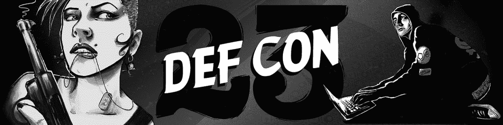

# DEF CON 23 的塞维利亚

> 原文：<https://www.social-engineer.org/event-updates/defcon-updates/the-sevillage-at-def-con-23/>

你准备好跑了吗？

这让你产生了什么样的情绪？对我和我的团队来说，这是一种兴奋和疲惫的混合。今年将证明没有什么不同；如果有什么不同的话，那就是两者兼而有之。

我们只是想花点时间向您简要介绍一下我们为 DEF CON 计划的所有活动，这样您就可以做好准备，尽可能多的在 SEVillage 内和周围活动。

首先，我们必须为国防部长们脱帽致敬。去年，为了进入 SEVillage，我们总是要等上 45 分钟，所以今年，他们给了我们三倍于正常空间的空间，回应了你们所有的求助。是的，你听到了，超过正常空间的三倍！我们打算用这些多余的空间做什么？

周四 :
我们创造了一个新的挑战，叫做“不可能完成的任务”。也许最好的描述方式是，如果《外国佬勇士挑战赛》在从世界的东南端获得一些 DNA 的同时，在开锁村生了一个孩子，这将催生《碟中谍》。

我现在能听到你们都在说，“啊，多可爱的宝宝啊！”

周四上午，我们将接受数量非常有限的现场报名，成为第一批参加这一令人惊叹的新比赛的参赛者。从午餐后不久开始，选手们将参加一项独特的挑战，在现场环境中测试他们。

每个参赛者都将被“逮捕”，然后锁在审讯室。他们将不得不与时间战斗来释放自己，然后沿着大师 se 的道路，最终从保险箱中获得最高机密代码，并安全逃离。

出席所有的细节，并报名成为少数几个能够参与的精英之一。

周五:
早上 9:30(好吧，为了 DEF CON)我们开始了现在臭名昭著的 SECTF(社会工程为那些住在山洞里的人捕捉旗帜)。参赛者将进入 doom(是的，这是它的真名)的玻璃展台，在现场观众面前打电话。今年我们会有更多的空间，更多的人，很多很多的相机(不要问只是来看看)。

我们将作为一个房间来听和分析每个电话，谈论人们是如何/为什么成功的。这将一直持续到下午 4 点，届时赛维拉格将从 SECTF 赛道转到 DEF CON 赛道。

那天晚上我们有五个演示来吸引、教育和娱乐你。演示将从星期五下午 4 点到 9 点持续。

**周六:**
如果周五还不够早的话，我们将更早开始(是的，早上 09:00)来启动我们的常驻 SE-Kids 活动。我们的第四年将会是最好的一年！SECTF 将在孩子们上午 10 点出发后开始，并在孩子们受苦时继续进行。

再一次，我们将让男人和女人对抗美国公司直到下午 4 点。另外 5 场旨在真正激发我们每个人的社会工程师的演讲将持续到晚上 9 点。

在许多欢笑和短暂的休息之后，我们会回来的…..

周日:
上午 10 点整，我们将开始直播——你不会想错过这个的，因为我们有一位非常特殊的客人…保罗·威尔逊……是的，就是来自“英国真实骗局”的那个人，也是一个著名的魔术师和御术师。我们会谈论所有的事情，直到我们关门，准备闭幕式。

听起来很拥挤，不是吗？的确如此。！100%时速 10000 英里。我们总是说，“这将是有史以来最好的一年！”…今年也不会例外。我们的工作人员一直在加班加点，以确保您离开时既能享受娱乐，又能更聪明地了解 SE。来加入我们在 Bally 宫殿 3-4-5 房间，我们在那里见！请务必查看[日程页面](https://www.social-engineer.org/social-engineer-village/)了解更多详情。