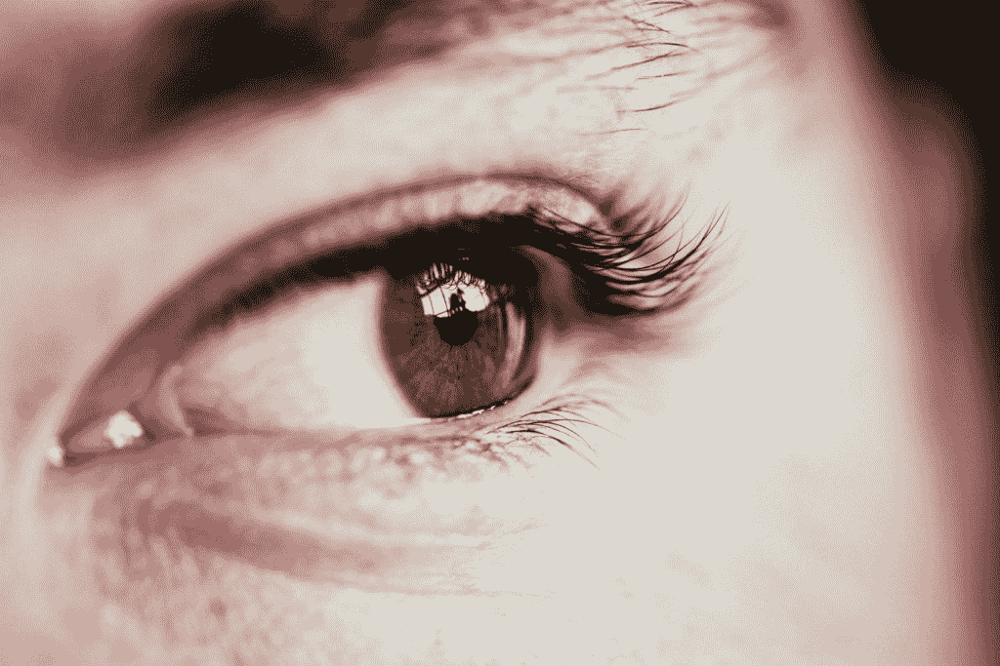

# 眼神交流和识破谎言的真相

> 原文：<https://www.social-engineer.org/social-engineering/the-truth-about-eye-contact-and-detecting-deception/>

多年来，研究表明，来自全球不同文化背景的人都认为缺乏眼神交流与他们认为对方在撒谎有关。这是真的吗？我们怎么知道？

对这个事实已经做了很多研究。保罗·艾克曼博士 和 [大卫·马苏莫特博士 o](http://www.davidmatsumoto.com/) 毕生致力于研究检测欺骗和辨别某人是否说谎的方法。最近，松本博士写了一篇博客，其中包括社会心理学家和微表情专家马克·弗兰克博士的大量研究。他的博客文章指出，许多视频、文章和新闻广播表明，一个人的目光接触和/或目光凝视往往有一个隐藏的含义:向右看意味着有人在编造一些东西。向左看意味着他们在回忆什么。如果有人没有看着你，他们在撒谎。

那么这些医生觉得这种错误的观点从何而来呢？松本博士写道，“这个复杂的问题没有简单的答案，但弗兰克博士暗示，这可能与儿童说谎时的行为有关。他指出，目光接触可能是欺骗年幼儿童的一个很好的线索——可能是由于内疚的情绪——但是，随着年龄的增长，儿童在社交方面认识到，为了成功撒谎，他们必须保持目光接触。

那么，判断某人是否在说谎的更好标准是什么呢？首先了解你的谈话对象是个好主意。正常讲话时他们会看你吗？还是他们把目光移开了？他们是紧张的谈话者还是自信的？了解他们在正常讲话中是如何说话的，将有助于你了解当你进入“不舒服的领域”时，这种模式是否会改变。如果当你开始问一个人一些可能难以回答的问题时，他的模式发生了变化，这可能表明他在撒谎。

## 新研究

新的研究得出结论，眼神交流并不意味着撒谎或说真话。2008 年，达尔豪西大学的斯蒂芬·波特博士发表了一项名为[说谎的研究？这张脸暴露了欺骗者的真实情感，但是是以意想不到的方式。](https://www.sciencedaily.com/releases/2008/04/080422200952.htm)

波特博士总结道，的确是面部暴露了说谎者，但不是以我们所认为的刻板印象的方式。对他来说,“测谎仪应该寻找的不是狡黠的眼睛、多汗的额头或细长的鼻子。”。相反，说谎者脸上的其他部分会暴露他们——短暂地“裂开”，让真实的情感流露到脸上”。

又一个微表情门柱上的凹口。学习如何读懂人们的微观和宏观表情有助于发现欺骗。

*图片*