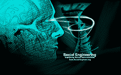

# 网络的官方资源对影响，欺骗和网络钓鱼预防-social-engineer.org

> 原文：<https://www.social-engineer.org/book-training-reviews/the-webs-official-resource-on-influence-deception-and-phishing-prevention-social-engineer-org/>

社会工程有一个坏名声，许多网站致力于“如何撒谎”、“如何免费得到这个或那个”以及“如何欺骗人们”。我们希望有一个地方，让专业的、有安全意识的行业专家可以分享想法、工具，并进行“光明正大”的对话我们想创建一个地方，让专业的社会工程师可以与行业专家会面并分享关于欺骗检测、[审讯](https://www.social-engineer.org/framework/psychological-principles/interview-interrogation/)、[神经语言编程](https://www.social-engineer.org/framework/psychological-principles/neuro-linguistic-programming-nlp/)、[启发](https://www.social-engineer.org/framework/influencing-others/elicitation/becoming-successful-elicitor/)和[伪装](https://www.social-engineer.org/framework/influencing-others/pretexting/)的信息。不仅仅是从一个角度，而是如何在生活的不同方面利用所有这些不同的方面。

因此，我们将 social-engineer.org 设计成一个存放工具、脚本、视频、操作指南和每月[播客](https://www.social-engineer.org/category/podcast/)的地方，这些播客将从安全感知、审讯、欺骗检测、渗透测试、心理学、执法等更多领域展示社会工程的各个方面。

social-engineer.org 的目标是什么？

我们的主要目标是让人们意识到存在的威胁。网络钓鱼、诈骗、身份盗窃的威胁……社会工程的恶意部分从我们许多人那里掠夺。

我们也希望有一个社区，来自各行各业使用社会工程的人们可以来分享他们的经验。这就是我们试图在 social-engineer.org 创造的。我们的关键特征是网络唯一的社会工程框架。概述社会工程的所有方面，以及它们与安全、生活、工作和爱好的关系。我们从网上收集了新闻报道、故事和经验，以及行业专家的研究，并对其进行了汇编，使其成为所有人都可以使用的神奇工具。

框架和网站都将是一个活生生的实体。它将继续增长久而久之。更多的深入研究、更多的操作方法和视频、更多的工具——所有这些都将继续增强网站。

**我们的愿景**

我们的愿景是继续添加到框架中，并在这一领域研究新的和令人兴奋的载体。与行业专家合作推广这项技术。继续共同努力，创建一个真正独特和特殊的对社会工程感兴趣的人的社区。

**谢谢**

我们想表达真诚的谢意。当我们发布求助电话时，我们不知道会发生什么，而回应是惊人的。我们真的要感谢所有贡献者的辛勤工作和优秀的文章。我们要感谢核心团队在渠道、研究和工具方面的帮助。最后但并非最不重要的，感谢开发团队的所有漫长的无数小时，使这成为现实。

我们现在还没有完成…我不认为我们会“完成”…所以如果你觉得你想贡献或帮助我们，请查看我们的[联系我们](https://www.social-engineer.org/contact-us/)页面，了解如何联系我们。访问我们的 irc 频道#social-engineer(在 freenode 上),关注我们的 Twitter [@humanhacker](https://twitter.com/humanhacker/)