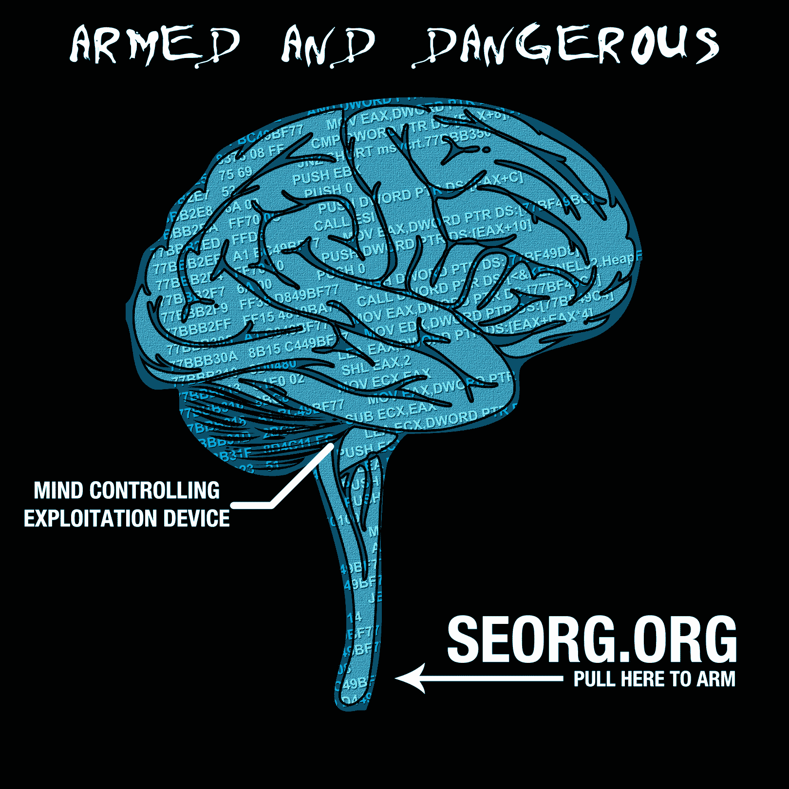

# “请不起设计师”竞赛的获胜者

> 原文：<https://www.social-engineer.org/social-engineering/too-cheap-to-hire-a-designer-contest-winner/>

几周前，我们发出了举办第一次 t 恤大赛的请求，并发起了“我们太便宜了，请不起设计师”大赛。

我们有 6 个设计进入了决赛。总共有 2500 多张选票。

我们要祝贺伦纳德/明/迪吉普队…..

一个学生和播客的粉丝有一个 t 恤的概念，并把它带给了明，SEORG 的常驻奴隶和泰瑟枪男孩，他把它带给了 DigiP，DigiP 赋予了它生命。

《生命》在这次比赛中获得了超过 62%的第五名(爱它)选票。你的获奖设计是:

[T2】](https://www.social-engineer.org/social-engineering/too-cheap-to-hire-a-designer-contest-winner/attachment/1403-armed-dangerous-brain/)

正如承诺的那样，获胜的团队将获得一些 schwag 作为他们的赢家套餐的一部分！祝贺伦纳德、丹和汤姆集思广益，做出了一个伟大的设计，并获得了投票！

至于你们其他人——由于很多人要求 schwag，我们将接受 SEORG schwag 的网络订单，然后进行大量生产，并将其带到 Defcon。如果你不参加 Defcon，但仍然想要你的 schwag，让我们知道，我们会看看我们能做些什么。

订单的链接将很快准备好，我们会在推特上发布。

感谢你们的支持，再次祝贺获胜者！