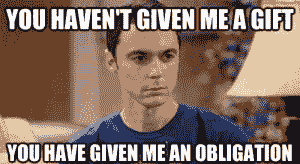

# 关于义务的真相

> 原文：<https://www.social-engineer.com/truth-obligations/>

[T2】](https://www.social-engineer.com/wp-content/uploads/2014/04/sheldon-cooper.jpg)

许多人可能不认为义务是影响的一个方面。然而，什么是义务呢？通常，这是一种基于规范、道德、甚至礼仪以及我们在生活中扮演的角色的感觉。这些感觉经常会刺激行动。如果我们不小心撞上了某人，作为社会中有礼貌的一员，我们觉得应该道歉。或者，作为配偶或父母，我们会(希望)感到有义务照顾我们的家庭成员。

## 这与社会工程师有什么关系？

我们经常看到义务被用作施加影响的工具。想想社交媒体是如何建立联系的。收到某人的“好友”邀请或专业联系通常会产生回应的需求，社交媒体网站利用这一点快速扩大自己的网络。或者，你有多少次仅仅因为别人给了你一张传单就接受了？大多数人都觉得不接受是不礼貌的。这是人类作为社会人的本性，也是我们被教导的行为方式。

## 义务是如何被利用的？

最近一个令人发指的债务剥削的例子是[祖父母骗局](https://money.cnn.com/2013/05/22/retirement/grandparent-scams/)。冒充老年人的孙子的骗子已经骗走了他们数百万美元，部分依靠他们作为祖父母的责任感。一名男子报道说，“你不想让你的孙子受到任何伤害”。

对于社会工程师来说，理解责任感有多强以及它们如何影响决策是一项关键技能。在我们为期 4 天的高级实用社会工程培训中，我们会谈到这一点和其他方面的影响。