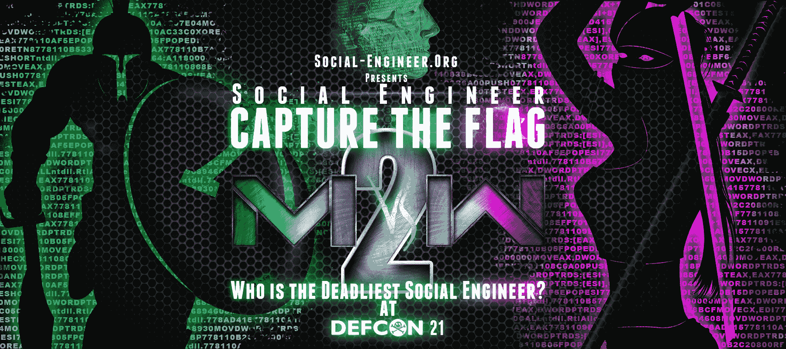

# 谁是最致命的社会工程师？Defcon 21 SECTF

> 原文：<https://www.social-engineer.org/event-updates/defcon-updates/who-is-the-deadliest-social-engineer-defcon-21-sectf/>

DEF CON 21 你准备好了吗？就在你认为它不会变得更好的时候，社会工程师 Capture the Flag (SECTF)今年变得越来越好。

为了保持有趣，我们决定让女士们再次与男士们竞争。去年，我们听到了一些战争呐喊，说女士们做得没有她们想要的那么好，需要复仇！！！所以，把你的脸涂成蓝色，拿起你的克莱莫地雷，准备好迎接另一场史诗般的性别之战——这就是今年“谁是最致命的社会工程师——男人 vs 女人 II”的风格

这是怎么回事？

从黑客的角度来看，社交工程是当今公司面临的最大威胁。黑客组织、骗子等都使用 se 技能来渗透公司、窃取数据和进行破坏。你知道的…我知道……(嘘，我想连“他们”都知道)，那么为什么它还没有被修复呢？

这场比赛微妙地提醒人们，社会工程可以有多危险。这场比赛说明，用一个简单的借口和 25 分钟的时间，让毫无戒心的目标交出惊人数量的信息是多么容易。

你有这种能力吗？女士们——这是给你们的……为你们的荣誉复仇，不要让今年成为 2012 年的重演。

如果你有勇气，想要荣耀，想要成为 DEF CON 历史的一部分，请点击[立即注册](https://www.social-engineer.org/social-engineer-ctf-who-is-the-deadliest-social-engineer/ "Defcon 21 SECTF Registration")按钮，或进入 DEF CON 21 SECTF 的菜单并立即注册。

注册将于美国东部时间 6 月 13 日晚上 11:59 结束——如果你忘记了，如果你睡着了——不要来抱怨。

如果你够男人，或者够女人-[现在就注册](https://www.social-engineer.org/social-engineer-ctf-who-is-the-deadliest-social-engineer/ "Register Now - SECTF")！

国防大会上见，SE 战士们。