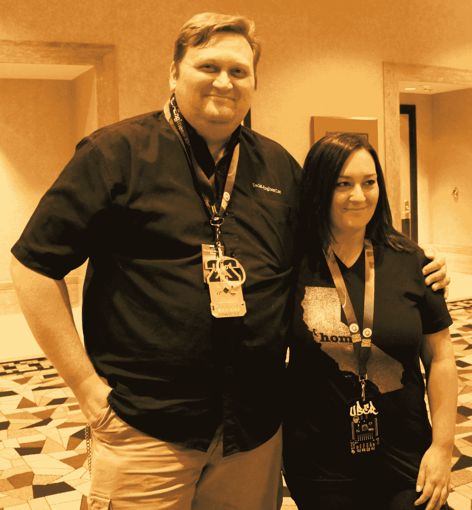

# 赢得第 22 届国防会议

> 原文：<https://www.social-engineer.org/event-updates/defcon-updates/winning-sectf-def-con-22/>

斯蒂芬妮·卡鲁泽斯写的

社会工程捕捉旗帜(SECTF)是在 DEF CON 上举行的竞赛。竞赛由两部分组成，信息收集阶段和现场呼叫阶段。随机指定一家目标公司，信息收集阶段从对该公司的研究开始(仅使用开源情报，没有实际接触)，然后根据发现的信息撰写报告。第二阶段发生在 DEF CON 期间，参赛者给目标公司打电话，试图收集尽可能多的旗帜。

这些标志基于各种信息组，例如:一般信息技术信息、供应商信息和员工信息。标志本身都是看似无关痛痒的信息，比如“使用的是什么操作系统”。但是，攻击者可以将该信息带到下一个级别，并基于该操作系统创建有针对性的攻击。

 今年是在 DEF CON 上举行 SECTF 的五周年纪念，有一个转折。这是一场集体竞赛，两个互不相识的参赛者被放在一起组成一个队。这给 CTF 带来了全新的活力，因为前几年它总是一个单独的竞争对手的事件。

在我们被分配到合作伙伴后不久，我们被分配到一个随机的目标公司。经过几周的研究和撰写我们的报告，我的团队(Schmooze Operators)使用 OSINT 在 29 个旗帜中总共找到了 18 个。我们找到的大多数旗帜都是通过社交媒体网站找到的。Instagram 是最大的信息供应商，发布了我们目标公司休息室和工作站的许多公开图片。

当计划我们的背景故事和角色时，我们决定利用男女团队的最佳方式是利用我们的性别刻板印象。一般来说，男性会从事信息技术工作，而女性会从事文书工作。我们在 DEF CON 现场打电话时使用的借口是，女性角色正在进行安全审计，以跟踪哪些供应商可以访问公司商店，男性角色正在审计计算机系统，以确保一切都是安全的和最新的。

大约在我的团队开会前一个小时，我的搭档生病了，无法再参加会议。在最后一分钟，我找到了史蒂夫·莫兰，他成为了我的新队友。只有 30 分钟的时间让他了解我们的借口和我们要打什么旗帜。

在我们的通话中，我首先提供了他们的商店号码，并要求目标员工确认我找到了正确的商店。一旦目标员工说这是正确的，我就说他们的商店经理(我使用了我在 OSINT 中找到的商店经理的真实姓名)应该通知他们我会打电话和我在 it 部门的同事一起做一个快速安全审计。一旦我的问题被问到，我就把电话转给我的队友，他也确认了商店号码。通过提供商店编号和经理姓名，就好像它们是“内部消息”,我们能够建立信任。

我们使用的另一个策略是不给他们思考的时间。在我快速介绍并建立信任后，我没有给员工时间将我转给经理或询问任何问题，而是直接开始提问。

在不到 30 分钟的时间里，我们成功地给目标公司打了三次电话。我们的电话之所以成功，有三个原因:

1)我们迎合了我们的性别刻板印象——男性从事信息技术工作，女性从事文书工作

2)假装有“内部消息”——知道店铺号和店长全名

3)“不要让他们思考”——不给目标时间说不或处理正在发生的事情

如果我们要求与经理交谈，而不是与商店经营者交谈，我们的电话可能会更有效，这样我们就可以获得更多的标志，因为一些经营者对我们提出的一些问题没有答案。

总的来说，今年组队很有趣，但也是一个挑战。我得感谢我的替补搭档史蒂夫，因为他站出来和我聊天。当然，非常感谢整个社会工程团队，他们在 SECTF 中投入了如此多的工作，这是显而易见的，感谢又一个伟大的一年！