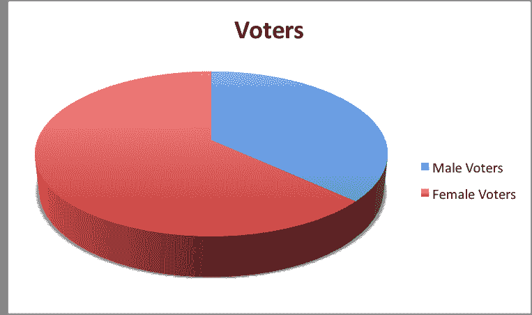
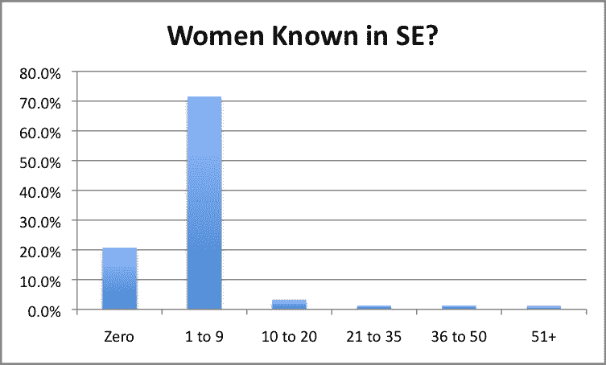
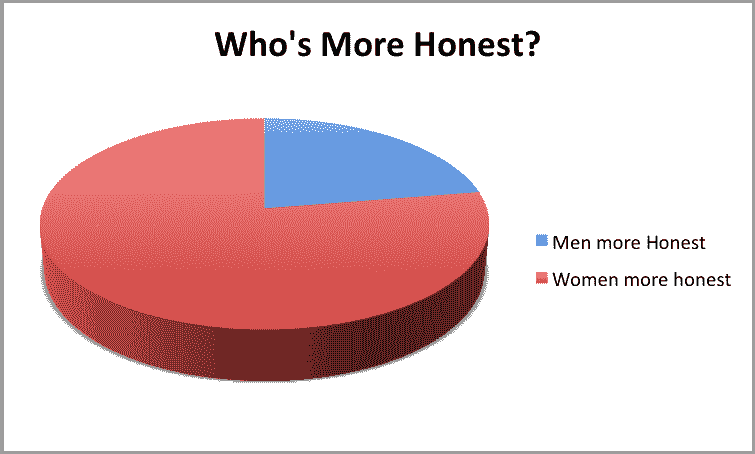
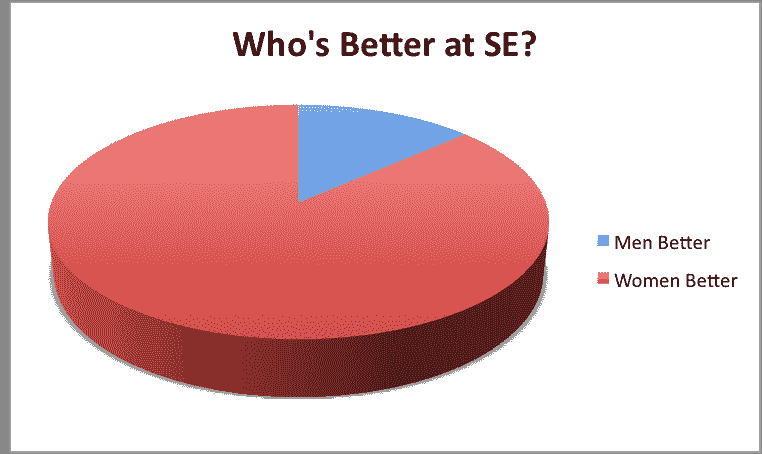

# 妇女和社会工程

> 原文：<https://www.social-engineer.org/social-engineering/women-and-social-engineering/>

社会工程领域的女性这个话题在 SEORG 已经讨论了很长时间了。几个月前，我们发起了一项民意调查，请公众对这个话题进行投票。至少可以说，结果令人惊讶。

我们把话题分成几个问题。

*   选民的性别
*   这位选民在安全部门认识多少女性？
*   他们认为谁天生更诚实？
*   他们觉得哪种性别自然会成为更好的社会工程师？

每个选民也有机会为自己的想法辩护。

首先，令我们惊喜的是有多少女性实际上参加了投票。

63%的选民是女性。这对我们来说是一个非常有趣的事实。在之前的讨论中，我们很难找到愿意讨论这个话题的女性。看到超过 60%的女性投票令人鼓舞，尤其是下一个细节。

每个选民在[安全](https://www.social-engineer.org/framework/general-discussion/ "Women in SE")中认识多少女性？

72%的选民只认识 1-9 名女性安全人员。令人震惊的是，21%的人不认识任何女性安保人员……从 1%到 3%不等，只有 1.2%的人认识 51 岁以上的女性安保人员。我们还发现有趣的是有多少男人组成了这组特殊的统计数据:

*   参与调查的男性中，78%的人不认识安保部门的女性
*   64%的人认识 1-9 个女人
*   11%的人知道 10-25 岁
*   0%的人知道 26-35 岁
*   5%的人知道 36-50 岁以上

下一组数据也非常有趣——谁更诚实？

这并不奇怪——只有 22%的投票者认为男性更诚实，而高达 77%的投票者认为女性天生更诚实。

现在所有这些都指向一条路，那就是谁被选为最擅长社会工程的人。在之前的播客讨论中，我们甚至从女性那里听到，许多人认为男性更擅长撒谎。到目前为止的统计数据似乎表明了这些事实…女性被认为更诚实，很多男性在安全方面不认识很多女性…

那么结果在哪里呢？

女性获得梦寐以求的最佳社会工程奖可能不足为奇，但让你震惊的是…

女性以惊人的 86%以上的优势胜出！86%参与投票的人表示，女性天生更倾向于社会工程！这对我们来说是一个巨大的统计数字。

当然，这又引出了几个问题:

1.为什么从事社会工程的女性不多？

2.如果有，它们在哪里？

3.女人有这种感觉还是男人有？

这就是统计数据变得非常有趣的地方。70%的男性投票认为女性是更好的社会工程师，而 95%的女性投票认为女性是更好的社会工程师。

显然，在不同性别中，这是他们能够达成一致的地方。

伙计们，想卫冕吗？女人，想证明自己是最棒的吗？

今年在 20 日的 Defcon 上，你将有机会证明这一点。公告和细节即将发布！

另外，下一次民意调查将启动我们关于信任和人们面孔的首次官方研究。要加入我们，请稍后再来查看，为我们提供照片，请发送电子邮件至 contribute [【受电子邮件保护】](/cdn-cgi/l/email-protection)social-engineer.org